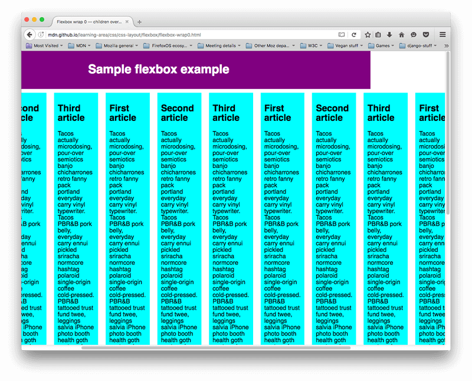

# Flexbox 布局
## 基本结构
1. Flex 布局在布局方向上分为水平方向上的 `main axis` 和垂直方向上的 `cross axis`：


2. 要使用 Flex 布局，要对父层元素的 `display` 属性进行声明：
```css
.container {
  display: flex;
    /* You can also set a display value of inline-flex if you wish to lay out inline items as flexible boxes. */
  display: inline-flex;
}
```

3. 对于 Flex 布局中的元素，分为父层元素（称为`flex container`）和其中的子层元素（称为 `flex items`）。

## Flex Container 父层
父层元素可以设置六个属性值，下面一个个去描述。

### flex-direction
Main axis 默认方向是水平（row），可以通过这个属性将主轴设置为垂直方向或者是反转方向：
```css
.container {
    flex-direction: column; /* 主轴为垂直方向 */
    flex-direction: row-reverse; /* 主轴在水平方向反转 */
}
```
默认值：`flex-direction: row;`

可选值：`column | row | row-reverse | column-reverse`

### flex-wrap
默认情况下，一行父层元素中的子元素会顺次排列不会换行，当空间不足时，项目尺寸会随之调整缩小，元素多了会造成溢出现象：

所以可以通过 `flex-wrap` 属性让子层元素自动换行
。
```css
.container {
    flex-wrap: wrap;
}
```
参考项目：[Flexbox - wrap](https://codesandbox.io/s/flexbox-wrap-p58qp)

默认值：`flex-wrap: nowrap;`

可选值：`nowrap | wrap | wrap-reverse`

### flex-flow
`flex-flow` 属性是 `flex-direction` 和 `flex-wrap` 的缩写：
```css
.container {
    flex-direction: row;
    flex-wrap: wrap;
}
```
等价于
```css
.container {
    flex-flow: row wrap;
}
```

### justify-content
该属性定义了子层元素在主轴（main axis）的对齐方式：
```css
.container {
    justify-content: flex-start | flex-end | center | space-between | space-around;
}
```

- flex-start（默认值）：左对齐
- flex-end：右对齐
- center： 居中
- space-between：两端对齐，项目之间的间隔都相等。
- space-around：每个项目两侧的间隔相等。所以，项目之间的间隔比项目与边框的间隔大一倍。

参考项目：[Flexbox-justify-content](https://codesandbox.io/s/flexbox-justify-content-rzf38?file=/index.html)

默认值：`flex-wrap: flex-start;`

可选值：`flex-start | flex-end | center | space-between | space-around`

### align-items
和 `justify-content` 对应，该属性定义了子层元素在交叉轴（cross axis）上的对齐方式。
```css
.container {
    align-items: flex-start | flex-end | center | baseline | stretch;
}
```

- flex-start：交叉轴的起点对齐。
- flex-end：交叉轴的终点对齐。
- center：交叉轴的中点对齐。
- baseline: 项目的第一行文字的基线对齐。
- stretch（默认值）：如果项目未设置高度或设为auto，将占满整个容器的高度。

参考项目：[Flexbox-align-items](https://codesandbox.io/s/flexbox-align-items-1t3t6)

默认值：`align-items: stretch;`

可选值：`flex-start | flex-end | center | baseline | stretch`

### align-content
该属性定义了多根轴线的对齐方式，如果项目只有一根轴线，将不起作用。
> 当我们 flex-wrap 设置为 nowrap 的时候，容器仅存在一根轴线，因为项目不会换行，就不会产生多条轴线。 当我们 flex-wrap 设置为 wrap 的时候，容器可能会出现多条轴线，这时候就需要去设置多条轴线之间的对齐方式了。

```css
.container {
    align-content: flex-start | flex-end | center | space-between | space-around | stretch;
}
```

- flex-start：与交叉轴的起点对齐。
- flex-end：与交叉轴的终点对齐。
- center：与交叉轴的中点对齐。
- space-between：与交叉轴两端对齐，轴线之间的间隔平均分布。
- space-around：每根轴线两侧的间隔都相等。所以，轴线之间的间隔比轴线与边框的间隔大一倍。
- stretch（默认值）：轴线占满整个交叉轴。

参考项目：[Flexbox-align-content](https://codesandbox.io/s/flexbox-align-content-ms22r?file=/index.html)
默认值：`align-content: stretch;`
可选值：`flex-start | flex-end | center | space-between | space-around | stretch`

## Flex Items 子层
子层元素也是有六个属性可以去设置。

### order
order属性定义项目的排列顺序。数值越小，排列越靠前，默认为0。

```css
.item {
    order: 0;
}
```


### flex-grow
flex-grow 属性定义项目的放大比例，默认为0，即如果存在剩余空间，也不放大。

```css
.item {
  flex-grow: <number>; /* default 0 */
}
```
如果所有项目的flex-grow属性都为1，则它们将等分剩余空间（如果有的话）。如果一个项目的flex-grow属性为2，其他项目都为1，则前者占据的剩余空间将比其他项多一倍。

### flex-shrink
flex-shrink 属性定义了项目的缩小比例，默认为1，即如果空间不足，该项目将缩小。

```css
.item {
  flex-shrink: <number>; /* default 1 */
}
```
如果所有项目的flex-shrink属性都为1，当空间不足时，都将等比例缩小。如果一个项目的flex-shrink属性为0，其他项目都为1，则空间不足时，属性为0的不缩小。负值对该属性无效。

参考项目：[flexbox-grow-shrink](https://codesandbox.io/s/flexbox-grow-shrink-yyqij?file=/index.html)


### flex-basis
flex-basis属性定义了在分配多余空间之前，项目占据的主轴空间（main size）。浏览器根据这个属性，计算主轴是否有多余空间。它的默认值为auto，即项目的本来大小。

```css
.item {
  flex-basis: <length> | auto; /* default auto */
}
```
它可以设为跟`width`或`height`属性一样的值（比如350px），则项目将占据固定空间。当 flex-basis值为 0 %时，是把该项目视为零尺寸的，故即使声明该尺寸为 140px，也并没有什么用。 - 当 flex-basis 值为 auto 时，则跟根据尺寸的设定值(假如为 100px)，则这 100px 不会纳入剩余空间。

### flex
`flex-grow | flex-shrink | flex-basis`的缩写。

```css
.item {
    /* Two values: flex-grow | flex-basis */
    flex: 1 30px;
    
    /* Two values: flex-grow | flex-shrink */
    flex: 2 2;

    /* Three values: flex-grow | flex-shrink | flex-basis */
    flex: 2 2 10%;
}
```

默认值：`flex: 0 1 auto;`

该属性有两个快捷值：`auto` (1 1 auto) 和 `none` (0 0 auto)。

### align-self
align-self 属性允许单个项目有与其他项目不一样的对齐方式，可覆盖 align-items 属性。默认值为 auto，表示继承父元素的 align-items 属性，如果没有父元素，则等同于 stretch。

```css
.item {
  align-self: auto | flex-start | flex-end | center | baseline | stretch;
}
```


## 相关参考
[阮一峰 - Flex布局](https://www.ruanyifeng.com/blog/2015/07/flex-grammar.html)
[Flexbox - MDN](https://developer.mozilla.org/en-US/docs/Learn/CSS/CSS_layout/Flexbox)