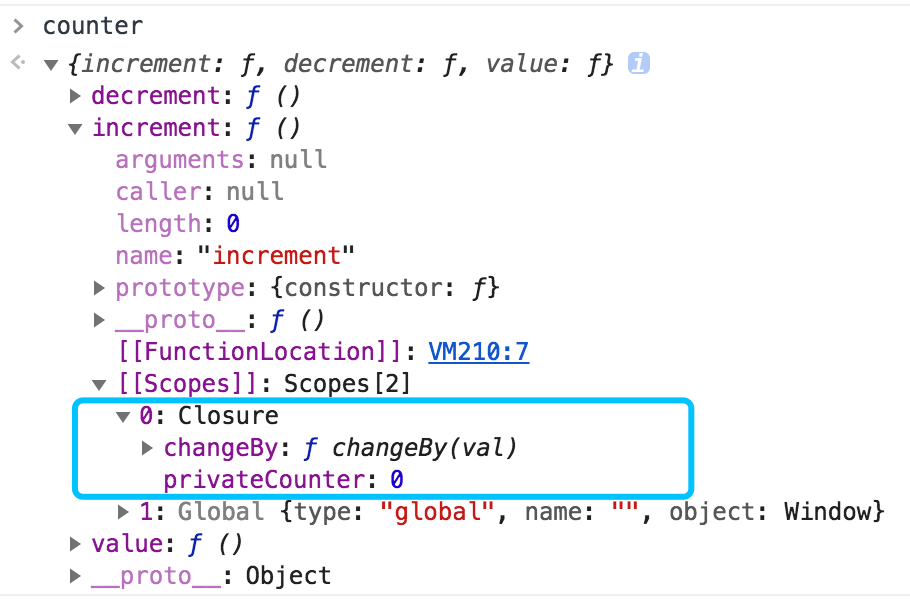

# 闭包(Closures)

## 定义
> A closure is the combination of a function and the lexical environment within which that function was declared. This environment consists of any local variables that were in-scope at the time the closure was created. -- MDN

闭包是`函数`和`词法环境`（该函数声明的）的组合。

函数就不用解释了，那么，什么是词法环境(the lexical environment)呢？根据定义：
> This environment consists of any local variables that were in-scope at the time the closure was created.
当闭包被创建时，所有的在这个闭包的作用域内的变量组成的环境，即为`Lexical environment`。

## Lexical scoping
首先解释一下，什么是 `lexical scoping`（词法作用域）？

> `lexical scoping`: describes how a parser resolves variable names when functions are nested. 

> The word "lexical" refers to the fact that lexical scoping uses the location where a variable is declared within the source code to determine where that variable is available. 
e.g. : Nested functions have access to variables declared in their outer scope.

举个实例：
```js
function init() {
  var name = 'Mozilla'; // name is a local variable created by init
  function displayName() { // displayName() is the inner function, a closure
    console.log(name); // use variable declared in the parent function    
  }
  displayName();    
}
init();
```

`displayName()`就是一个closure，虽然`displayName()`没有属于它的本地变量，但因为`Lexical scoping`的存在，使得它可以访问来自父函数的变量`name`，成功输出了`name`的值。

## Closure
来看一个例子：
```js
function makeFunc() {
  var name = 'Mozilla'; // name is a local variable created by makeFunc
  function displayName() { // displayName() is the inner function, a closure
    console.log(name); // use variable declared in the parent function 
  }
  return displayName;
}
var myFunc = makeFunc();
myFunc();
```

the local variables within a function exist only for the duration of that function's execution.
Once makeFunc() has finished executing, you might expect that the name variable would no longer be accessible, However, because the code still works as expected, this is obviously not the case in JavaScript.

The reason is that functions in JavaScript form closure.
**A closure is the combination of a function and the lexical environment within which that function was declared. This environment consists of any local variables that were in-scope at the time the closure was created.**

In this case, `myFunc` is a reference to the instance of the function `displayName` created when `makeFunc` is run.

**The instance of `displayName` maintains a reference to its lexical environment, within which the variable name exists.** 

 For this reason, when `myFunc` is invoked, the variable name remains available for use and "Mozilla" is passed to console.log.

我们再看一个例子：
```js
function makeAdder(x) {
  return function(y) {
    return x + y;
  };
}

var add5 = makeAdder(5);
var add10 = makeAdder(10);

console.log(add5(2));  // 7
console.log(add10(2)); // 12
```

`add5` 和 `add10` 都是闭包。它们共享相同的函数定义，但是保存了不同的词法环境。在 `add5` 的环境中，x 为 5。而在 `add10` 中，x 则为 10。

## Emulating private methods with closures
我们可以使用闭包来模拟私有方法。
私有方法不仅仅有利于限制对代码的访问，还提供了管理全局命名空间的强大能力，避免非核心的方法弄乱了代码的公共接口部分。

看以下这个示例：
```js
var counter = (function() {
  var privateCounter = 0;
  function changeBy(val) {
    privateCounter += val;
  }
  return {
    increment: function() {
      changeBy(1);
    },
    decrement: function() {
      changeBy(-1);
    },
    value: function() {
      return privateCounter;
    }
  };   
})();

console.log(counter.value()); // logs 0
counter.increment();
counter.increment();
console.log(counter.value()); // logs 2
counter.decrement();
console.log(counter.value()); // logs 1
```

控制台输出`counter`，`counter`是一个 Closure：


we create a single lexical environment that is shared by three functions: `counter.increment`, `counter.decrement`, and `counter.value`.（这三个函数同时也是闭包，共享同一个词法作用域）

The shared lexical environment is created in the body of an anonymous function, which is executed as soon as it has been defined. The lexical environment contains two private items: a variable called `privateCounter` and a function called `changeBy`. 
Neither of these private items can be accessed directly from outside the anonymous function. Instead, they must be accessed by the three public functions that are returned from the anonymous wrapper.

## Closure Scope Chain
所有closure 都有这三种作用域：
1. Local Scope (本地作用域)
2. Outer Functions Scope (外部函数作用域)
3. Global Scope (全局作用域)

举个例子，请看注释：
```js
// global scope
var e = 10;
function sum(a){
  // outer functions scope
  return function(b){
    // outer functions scope
    return function(c){
      // outer functions scope
      return function(d){
        // local scope
        return a + b + c + d + e;
      }
    }
  }
}
console.log(sum(1)(2)(3)(4)); // 20
```

## A common mistake: Creating closures in loops

[查看该常见错误及4种解决方法](https://developer.mozilla.org/en-US/docs/Web/JavaScript/Closures#Creating_closures_in_loops_A_common_mistake)

## Performance considerations
It is unwise to unnecessarily create functions within other functions if closures are not needed for a particular task, as it will negatively affect script performance both in terms of processing speed and memory consumption.

For instance, when creating a new object/class, methods should normally be associated to the object's prototype rather than defined into the object constructor. The reason is that whenever the constructor is called, the methods would get reassigned (that is, for every object creation).

Consider the following case:
```js
// 这是一个没有必要使用闭包的例子
function MyObject(name, message) {
  this.name = name.toString();
  this.message = message.toString();
  this.getName = function() {
    return this.name;
  };
  this.getMessage = function() {
    return this.message;
  };
}
```

we could instead rewrite it to avoid using closure as follows:
```js
function MyObject(name, message) {
  this.name = name.toString();
  this.message = message.toString();
}
MyObject.prototype = {
  getName: function() {
    return this.name;
  },
  getMessage: function() {
    return this.message;
  }
};
```
However, redefining the prototype is not recommended. 

The following example instead appends to the existing prototype:
```js
function MyObject(name, message) {
  this.name = name.toString();
  this.message = message.toString();
}
MyObject.prototype.getName = function() {
  return this.name;
};
MyObject.prototype.getMessage = function() {
  return this.message;
};
```
In the two previous examples, the inherited prototype can be shared by all objects and the method definitions need not occur at every object creation.

## 参考资料
[Closures - JavaScript | MDN](https://developer.mozilla.org/en-US/docs/Web/JavaScript/Closures)