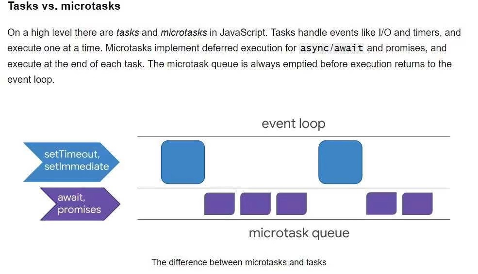

# Event Loop（事件循环）

## 总览
JS 里有两种任务类型：

macroTask（宏任务）: `setTimeout`, `setInterval`, `setImmediate`, `requestAnimationFrame`, `user Input/Output`, `UI rendering`

microTask（微任务）: `process.nextTick（Node）`, `Promise`, `Object.observe(废弃)`, `MutaionObserver`

Javascript 有一个 `main thread 主线程`和 `call-stack 调用栈(执行栈)`，所有的任务都会被放到调用栈等待主线程执行。

### Event Loop示意图




总的来说，执行顺序是

宏任务1，微任务1.1…

宏任务2，微任务2.1，微任务2.2…

宏任务3，微任务3.1，微任务3.2，微任务3.3…

…

宏任务X，微任务X.1，微任务X.2…

依次执行直至清空队列。

## 定义
> `Stack`: Function calls form a stack of frames.

> `Queue`: A JavaScript runtime uses a **message queue**, which is a list of messages to be processed. Each message has an associated function which gets called in order to handle the message.
> At some point during the event loop, the runtime starts handling the messages on the queue, **starting with the oldest one**. To do so, the message is removed from the queue and its corresponding function is called with the message as an input parameter. As always, calling a function creates a new stack frame for that function's use.
> The processing of functions continues until the stack is once again empty; then the event loop will process the next message in the queue (if there is one).

## 执行顺序
下文中的 `task` 统指 `macroTask`。

Event Loop 大概是这么个执行法（非官方）：
1. 遇上 timer 类型的 API（如setTimeout/setInterval/setImmediate）注册的函数，会等到指定时间后进入 task 队列。
2. 不同的 API 注册的异步任务会依次进入自身对应的 task/microtask 队列，然后等待 Event Loop 将它们依次压入执行栈中执行。
3. Event Loop 开始：从 `task` 队列中拉出一个 `task` 执行，当这个 `task` 执行结束，检查 `microtask` 队列是否为空，不为空则依次执行直至清空 `microtask` 队列。
4. 从 `task` 队列中拉出下一个 `task` 执行，反复循环。

看下面一个例子：
```js
console.log('script start');

setTimeout(function() {
  console.log('setTimeout');
    Promise.resolve().then(function() {
      console.log('promise11');
    }).then(function() {
      console.log('promise22');
    });
}, 0);

new Promise(resolve => {
  console.log('resolve');
  resolve();
}).
then(function() {
  console.log('promise1');
}).then(function() {
  console.log('promise2');
});

console.log('script end');

/* 执行顺序
script start
resolve
script end
promise1
promise2
setTimeout
promise11
promise22
*/
```

再看一个例子：
```js
new Promise(resolve => {
  console.log('Promise1');
  resolve();
})
.then(function() {
	console.log('promise11');
})
.then(function() {
	console.log('promise111');
})

console.log('script start');

new Promise(resolve => {
  console.log('Promise2');
  resolve();
})
.then(function() {
	console.log('promise22');
})
.then(function() {
	console.log('promise222');
})

console.log('script end');

/* 执行顺序
Promise1
script start
Promise2
script end
promise11
promise22
promise111
promise222
*/
```

最后看这一个例子：
```js
console.log('script start')

async function async1() {
  await async2();
  console.log('async1 end');
}

async function async2() {
  console.log('async2 end');
}

async1();

setTimeout(function() {
  console.log('setTimeout');
}, 0)

new Promise(resolve => {
  console.log('Promise');
  resolve();
})
.then(function() {
  console.log('promise1');
})
.then(function() {
  console.log('promise2');
})

console.log('script end');

/* 执行顺序
script start
async2 end
Promise
script end
promise1
promise2
async1 end
setTimeout
*/
```
**问题是，为什么`async1 end`在`promise2`之后输出？**

`async/await` 在底层转换成了 promise 和 then 回调函数，每次我们使用 `await`, 解释器都创建一个 `Promise对象`，然后把剩下的 async 函数中的操作放到 then 回调函数中。
例如：
```js
async function f() {
  await p
  console.log('ok')
}
```
可以简化理解为：
```js
function f() {
  return RESOLVE(p).then(() => {
    console.log('ok')
  })
}
```

如果 `RESOLVE(p)` 对于 p 为 Promise 直接返回 p 的话，那么 p的 then 方法就会被马上调用，其回调就立即进入 job 队列。

而如果 `RESOLVE(p)` 严格按照标准，应该是产生一个新的 Promise，尽管该 promise 确定会 resolve 为 p，但这个过程本身是异步的，也就是现在进入 job 队列的是新 promise 的 resolve 过程，所以该 promise 的 then 不会被立即调用，而要等到当前 job 队列执行到前述 resolve 过程才会被调用，然后其回调（也就是继续 await 之后的语句）才加入 job 队列，所以时序上就晚了。

## 参考资料
- [从一道题浅说 JavaScript 的事件循环](https://github.com/Advanced-Frontend/Daily-Interview-Question/issues/7)

- 看这篇文章中举出的两个例子，就能清楚 macroTask 和 microTask 执行的顺序：
[Tasks, microtasks, queues and schedules - JakeArchibald.com](https://jakearchibald.com/2015/tasks-microtasks-queues-and-schedules/)

- [Concurrency model and Event Loop - JavaScript | MDN](https://developer.mozilla.org/en-US/docs/Web/JavaScript/EventLoop)

- [Tasks, microtasks, queues and schedules - JakeArchibald.com](https://jakearchibald.com/2015/tasks-microtasks-queues-and-schedules/)

- [Event Loop的规范和实现](https://zhuanlan.zhihu.com/p/33087629)