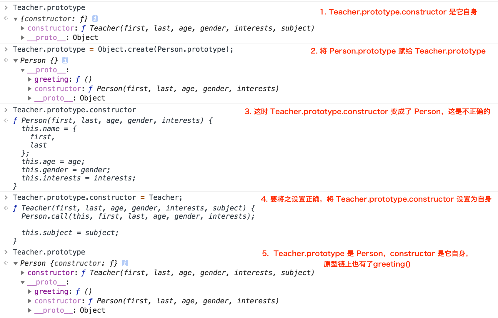

#  Inheritance and the prototype chain 2 (继承与原型链 - 下) 
::: warning Objective
To understand how it is possible to implement inheritance in JavaScript.
:::

**How do we create an object in JavaScript that inherits from another object?**

## Getting started
we've defined only the properties inside the constructor. The methods are all defined on the constructor's prototype. 
For example:
```js
function Person(first, last, age, gender, interests) {
  this.name = {
    first,
    last
  };
  this.age = age;
  this.gender = gender;
  this.interests = interests;
};

Person.prototype.greeting = function() {
  alert('Hi! I\'m ' + this.name.first + '.');
};
```

Then we wanted to create a `Teacher` class, like the one we described in our initial object-oriented definition, which inherits all the members from `Person`, but also includes:
1. A new property, `subject` — this will contain the subject the teacher teaches.
2. An updated `greeting() `method, which sounds a bit more formal than the standard `greeting()` method — more suitable for a teacher addressing some students at school.

we need to do is create a `Teacher()` constructor — add the following below the existing code:
```js
function Teacher(first, last, age, gender, interests, subject) {
  Person.call(this, first, last, age, gender, interests);
  this.subject = subject;
}
```

> the `call()` function. This function basically allows you to call a function defined somewhere else, but in the current context. The first parameter specifies the value of this that you want to use when running the function, and the other parameters are those that should be passed to the function when it is invoked.

We want the `Teacher()` constructor to take the same parameters as the `Person()` constructor it is inheriting from, so we specify them all as parameters in the `call()` invocation.

## Setting Teacher()'s prototype and constructor reference
But we have a problem. We have defined a new constructor —— `Teacher`, and it has a prototype property, which by default just contains a reference to the constructor function itself. It does not contain the methods of the `Person` constructor's prototype property.


并且比较`Person.prototype`和`Teacher.prototype`上的`property`，我们发现`Teacher`并没有继承`Person.prototype.greeting`。

But we need to get `Teacher()` to inherit the methods defined on `Person()'s prototype`. So how do we do that?

1. Add the following line below your previous addition:
```js
Teacher.prototype = Object.create(Person.prototype);
```
2. But `Teacher.prototype's constructor` property is now equal to `Person()`, because we just set `Teacher.prototype` to reference an object that inherits its properties from `Person.prototype`!  so we need to add the following line at the bottom:
```js
Teacher.prototype.constructor = Teacher;
```



Entering  `Teacher.prototype.constructor `should return `Teacher()`, as desired, plus we are now inheriting from `Person()`!

## Giving Teacher() a new greeting() function
If we need to define `a new greeting() function` on the `Teacher()` constructor.
The easiest way to do this is to define it on `Teacher()'s prototype`:
```js
Teacher.prototype.greeting = function() {
	// balabala code...
};
```

## ES6 Classes
### rewritten version with class-style
we'll convert the `Person and Teacher examples` from prototypal inheritance to classes, to show you how it's done:
Let's look at a rewritten version of the Person example, class-style:
```js
class Person {
	// The constructor() method defines the constructor function that represents our Person class.
  constructor(first, last, age, gender, interests) {
    this.name = {
      first,
      last
    };
    this.age = age;
    this.gender = gender;
    this.interests = interests;
  }
	// greeting() is class methods.
  greeting() {
    console.log(`Hi! I'm ${this.name.first}`);
  };
}
```

We can now instantiate object instances using the `new` operator, in just the same way as we did before:
```js
let han = new Person('Han', 'Solo', 25, 'male', ['Smuggling']);
han.greeting(); // Hi! I'm Han
```

### Inheritance with class syntax
we'll create our specialized `Teacher` class, making it inherit from `Person` using modern class syntax.
To create a subclass we use the `extends` keyword to tell JavaScript the class we want to base our class on.
```js
class Teacher extends Person {
  constructor(first, last, age, gender, interests, subject, grade) {
    this.name = {
      first,
      last
    };
  this.age = age;
  this.gender = gender;
  this.interests = interests;
  // subject and grade are specific to Teacher
  this.subject = subject;
  this.grade = grade;
  }
}
```

重复声明`Person`的属性显然是不必要的，我们可以使用`super`关键词来简化代码：
> the `super()` operator as the first item inside the `constructor()`. **This will call the parent class’ constructor, and inherit the members we specify as parameters of `super()`**
```js
class Teacher extends Person {
  constructor(first, last, age, gender, interests, subject, grade) {
    super(first, last, age, gender, interests);

    // subject and grade are specific to Teacher
    this.subject = subject;
    this.grade = grade;
  }
}
```

When we instantiate Teacher object instances, we can now call methods and properties defined on both `Teacher` and `Person`, as we'd expect:
```js
let snape = new Teacher('Severus', 'Snape', 58, 'male', ['Potions'], 'Dark arts', 5);
snape.greeting(); // Hi! I'm Severus.
snape.age // 58
snape.subject; // Dark arts
```

## Inheriting from a constructor with no parameters
Note that if the constructor you are inheriting from doesn't take its property values from parameters, you don't need to specify them as additional arguments in `call()`. 
```js
function Brick() {
  this.width = 10;
  this.height = 20;
}
```
You could inherit the `width` and `height` properties by doing this:
```js
function BlueGlassBrick() {
  Brick.call(this);

  this.opacity = 0.5;
  this.color = 'blue';
}
```
Note that we've only specified `this` inside `call()` — no other parameters are required as we are not inheriting any properties from the parent that are set via parameters.

## 参考资料
[Inheritance in JavaScript - Learn web development | MDN](https://developer.mozilla.org/en-US/docs/Learn/JavaScript/Objects/Inheritance)