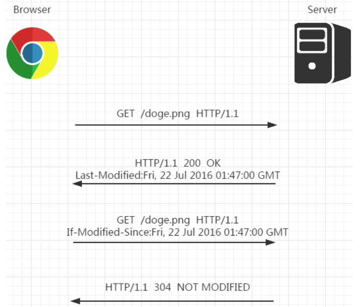

# 浏览器缓存
对于web应用来说，缓存是提升页面性能同时减少服务器压力的利器。

## 浏览器缓存类型

### 1. 强缓存：
> 不会向服务器发送请求，直接从缓存中读取资源，在chrome控制台的network选项中可以看到该请求返回200的状态码，并且size显示from disk cache或from memory cache；

**相关的header:**

**Expires**：response header里的过期时间，浏览器再次加载资源时，如果在这个过期时间内，则命中强缓存。它的值为一个绝对时间的GMT格式的时间字符串， 比如Expires:Thu,21 Jan 2018 23:39:02 GMT

**Cache-Control**：这是一个相对时间，在配置缓存的时候，以秒为单位，用数值表示。当值设为max-age=300时，则代表在这个请求正确返回时间（浏览器也会记录下来）的5分钟内再次加载资源，就会命中强缓存。比如Cache-Control:max-age=300，

简单概括：其实这两者差别不大，区别就在于 Expires 是http1.0的产物，Cache-Control是http1.1的产物，**两者同时存在的话，Cache-Control优先级高于Expires**；在某些不支持HTTP1.1的环境下，Expires就会发挥用处。所以Expires其实是过时的产物，现阶段它的存在只是一种兼容性的写法。强缓存判断是否缓存的依据来自于是否超出某个时间或者某个时间段，而不关心服务器端文件是否已经更新，这可能会导致加载文件不是服务器端最新的内容，**那我们如何获知服务器端内容较客户端是否已经发生了更新呢？此时我们需要协商缓存策略。**

### 2. 协商缓存：
> 向服务器发送请求，服务器会根据这个请求的request header的一些参数来判断是否命中协商缓存，如果命中，则返回304状态码并带上新的response header通知浏览器从缓存中读取资源；另外协商缓存需要与cache-control共同使用。

**相关的header:**

1. **Last-Modified** 和 **If-Modified-Since**：当第一次请求资源时，服务器将资源传递给客户端时，会将资源最后更改的时间以“Last-Modified: GMT”的形式加在实体首部上一起返回给客户端。

`Last-Modified: Fri, 22 Jul 2016 01:47:00 GMT`

客户端会为资源标记上该信息，下次再次请求时，会把该信息附带在请求报文中一并带给服务器去做检查，若传递的时间值与服务器上该资源最终修改时间是一致的，则说明该资源没有被修改过，**直接返回304状态码，内容为空**，这样就节省了传输数据量 。如果两个时间不一致，则服务器会发回该资源并返回200状态码，和第一次请求时类似。这样保证不向客户端重复发出资源，也保证当服务器有变化时，客户端能够得到最新的资源。一个304响应比一个静态资源通常小得多，这样就节省了网络带宽。

但 last-modified 存在一些缺点：

**Ⅰ.某些服务端不能获取精确的修改时间**

**Ⅱ.文件修改时间改了，但文件内容却没有变**

既然根据文件修改时间来决定是否缓存尚有不足，能否可以直接根据文件内容是否修改来决定缓存策略？---- ETag和If-None-Match

2. **ETag** 和 **If-None-Match**：Etag是上一次加载资源时，服务器返回的response header，是对该资源的一种唯一标识，只要资源有变化，Etag就会重新生成。浏览器在下一次加载资源向服务器发送请求时，会将上一次返回的Etag值放到request header里的If-None-Match里，服务器只需要比较客户端传来的If-None-Match跟自己服务器上该资源的ETag是否一致，就能很好地判断资源相对客户端而言是否被修改过了。

如果服务器发现ETag匹配不上，那么直接以常规GET 200回包形式将新的资源（当然也包括了新的ETag）发给客户端；如果ETag是一致的，则直接返回304知会客户端直接使用本地缓存即可。

**两者之间对比：**

**首先在精确度上，Etag要优于Last-Modified。**Last-Modified的时间单位是秒，如果某个文件在1秒内改变了多次，那么他们的Last-Modified其实并没有体现出来修改，但是Etag每次都会改变确保了精度；如果是负载均衡的服务器，各个服务器生成的Last-Modified也有可能不一致。

**第二在性能上，Etag要逊于Last-Modified**，毕竟Last-Modified只需要记录时间，而Etag需要服务器通过算法来计算出一个hash值。

**第三在优先级上，服务器校验优先考虑Etag。**

## 缓存的机制

**强制缓存优先于协商缓存进行，若强制缓存(Expires和Cache-Control)生效则直接使用缓存，若不生效则进行协商缓存(Last-Modified / If-Modified-Since和Etag / If-None-Match)，协商缓存由服务器决定是否使用缓存，若协商缓存失效，那么代表该请求的缓存失效，重新获取请求结果，再存入浏览器缓存中；生效则返回304，继续使用缓存。**主要过程如下：

**如果什么缓存策略都没设置，那么浏览器会怎么处理？**

对于这种情况，浏览器会采用一个启发式的算法，通常会取响应头中的 Date 减去 Last-Modified 值的 10% 作为缓存时间。

### **用户行为对浏览器缓存的影响**

1. 地址栏访问，链接跳转是正常用户行为，将会触发浏览器缓存机制；(查找 disk cache 中是否有匹配。如有则使用；如没有则发送网络请求。)

2. F5刷新，浏览器会设置max-age=0，跳过强缓存判断，会进行协商缓存判断；(因为 TAB 并没有关闭，因此 memory cache 是可用的，会被优先使用(如果匹配的话)。其次才是 disk cache。)

3. ctrl+F5刷新，跳过强缓存和协商缓存，直接从服务器拉取资源。(浏览器不使用缓存，因此发送的请求头部均带有 Cache-control: no-cache(为了兼容，还带了 Pragma: no-cache),服务器直接返回 200 和最新内容。)

## 缓存位置
从缓存位置上来说分为四种，并且各自有优先级，当依次查找缓存且都没有命中的时候，才会去请求网络。
1. Service Worker
2. Memory Cache
3. Disk Cache
4. Push Cache

### Service Worker
Service Worker 是运行在浏览器背后的独立线程，一般可以用来实现缓存功能。使用 Service Worker的话，传输协议必须为 HTTPS。因为 Service Worker 中涉及到请求拦截，所以必须使用 HTTPS 协议来保障安全。**Service Worker 的缓存与浏览器其他内建的缓存机制不同，它可以让我们自由控制缓存哪些文件、如何匹配缓存、如何读取缓存，并且缓存是持续性的。**

Service Worker 实现缓存功能一般分为三个步骤：首先需要先注册 Service Worker，然后监听到 install 事件以后就可以缓存需要的文件，那么在下次用户访问的时候就可以通过拦截请求的方式查询是否存在缓存，存在缓存的话就可以直接读取缓存文件，否则就去请求数据。

当 Service Worker 没有命中缓存的时候，我们需要去调用 fetch 函数获取数据。也就是说，如果我们没有在 Service Worker 命中缓存的话，会根据缓存查找优先级去查找数据。但是不管我们是从 Memory Cache 中还是从网络请求中获取的数据，浏览器都会显示我们是从 Service Worker 中获取的内容。

### Memory Cache
Memory Cache 也就是内存中的缓存，主要包含的是当前中页面中已经抓取到的资源,例如页面上已经下载的样式、脚本、图片等。读取内存中的数据肯定比磁盘快,内存缓存虽然读取高效，可是缓存持续性很短，会随着进程的释放而释放。 一旦我们关闭 Tab 页面，内存中的缓存也就被释放了。

### Disk Cache
Disk Cache 也就是存储在硬盘中的缓存，读取速度慢点，但是什么都能存储到磁盘中，比之 Memory Cache 胜在容量和存储时效性上。

### Push Cache
Push Cache（推送缓存）是 HTTP/2 中的内容，当以上三种缓存都没有命中时，它才会被使用。**它只在会话（Session）中存在，一旦会话结束就被释放，并且缓存时间也很短暂**，在Chrome浏览器中只有5分钟左右，同时它也并非严格执行HTTP头中的缓存指令。

如果以上四种缓存都没有命中的话，那么只能发起请求来获取资源了。

## Reference

[深入理解浏览器的缓存机制](https://github.com/ljianshu/Blog/issues/23)