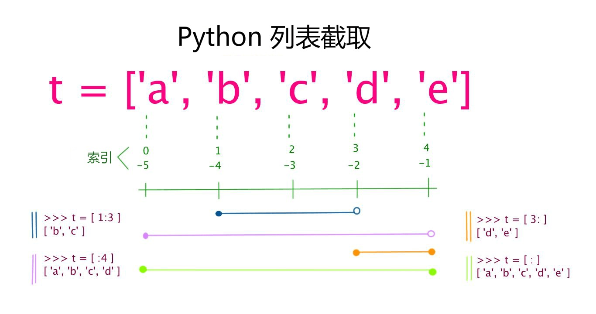
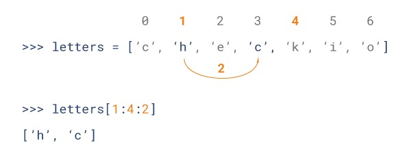
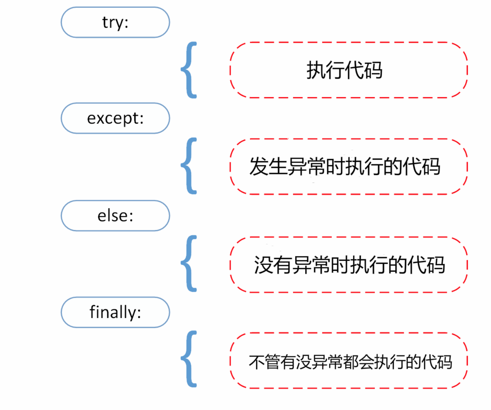

# 语法唤醒
> 熟悉 JavaScript 的基础上，对Python的学习。

## 运算符

- `+=`	加法赋值运算符	c += a 等效于 c = c + a  (其余的同理)
- `%`	取模 - 返回除法的余数
- `**`	幂 - 返回x的y次幂
- `//`	取整除 - 向下取接近除数的整数


```python
print(21 % 10)
print(2 ** 4)
print(9 // 2)
```

按位运算符是把数字看作二进制来进行计算。

- `&`   按位与运算符：参与运算的两个值,如果两个相应位都为1,则该位的结果为1,否则为0。
- `|`   按位或运算符：只要对应的二个二进位有一个为1时，结果位就为1。
- `^`	按位异或运算符：当两对应的二进位相异时，结果为1。
- `~`	按位取反运算符：对数据的每个二进制位取反,即把1变为0,把0变为1。
- `<<`	左移动运算符：运算数的各二进位全部左移若干位，由"<<"右边的数指定移动的位数，高位丢弃，低位补0。
- `>>`	右移动运算符：把">>"左边的运算数的各二进位全部右移若干位，">>"右边的数指定移动的位数。


```python
a = 60            # 60 = 0011 1100 
b = 13            # 13 = 0000 1101 
print(a & b)      # 12 = 0000 1100
print(a | b)      # 61 = 0011 1101
print(a ^ b)      # 49 = 0011 0001
print(~a)         # -61 = 1100 0011
print(a << 2)     # 240 = 1111 0000
print(a >> 2)     # 15 = 0000 1111
```

- `and`  布尔"与" - 如果 x 为 False，x and y 返回 False，否则它返回 y 的计算值。
- `or`	 布尔"或" - 如果 x 是 True，它返回 x 的值，否则它返回 y 的计算值。
- `not`	 布尔"非" - 如果 x 为 True，返回 False 。如果 x 为 False，它返回 True。

- `in`   如果在指定的序列中找到值返回 True，否则返回 False。
- `not in`	如果在指定的序列中没有找到值返回 True，否则返回 False。


```python
a = 10
b = 20
list = [1, 2, 3, 4, 5 ];
 
if ( a in list ):
   print ("变量 a 在给定的列表中 list 中")
else:
   print ("变量 a 不在给定的列表中 list 中")
```

## 标准数据类型
Python3 中有六个标准的数据类型：
- `Number（数字）`
- `String（字符串）`
- `List（列表）`
- `Tuple（元组）`
- `Set（集合）`
- `Dictionary（字典）`

Python3 的六个标准数据类型中：

不可变数据（3 个）：Number（数字）、String（字符串）、Tuple（元组）；

可变数据（3 个）：List（列表）、Dictionary（字典）、Set（集合）。

### Number（数字）
python中数字有四种类型：整数、布尔型、浮点数和复数。

- int (整数), 如 1, 只有一种整数类型 int，表示为长整型，没有 python2 中的 Long。
- bool (布尔), 如 True。
- float (浮点数), 如 1.23、3E-2
- complex (复数), 如 1 + 2j、 1.1 + 2.2j

内置方法：

- ` type()`函数可以用来查询变量所指的对象类型。

- `int(x)` 将x转换为一个整数。

- `float(x)` 将x转换到一个浮点数。

- `complex(x)` 将x转换到一个复数，实数部分为 x，虚数部分为 0。

- `complex(x, y)` 将 x 和 y 转换到一个复数，实数部分为 x，虚数部分为 y。x 和 y 是数字表达式。


```python
x = '12'
print(type(x))
print(type(int(x)))
```

### String（字符串）

- 反斜杠可以用来转义，使用`r`可以让反斜杠不发生转义。如 `r"this is a line with \n"` 则`\n`会显示，并不是换行。这里的 `r` 指 raw，即 raw string。
- Python 中的字符串有两种索引方式，从左往右以 `0` 开始，从右往左以 `-1` 开始。
- 字符串的截取的语法：`变量[头下标:尾下标:步长]`，遵循左闭右开原则，`str[0,2]`是不包含第 3 个字符的。
- `%`	 格式字符串。或者使用format函数
- 字符串可以用 `+` 运算符连接在一起，用 `*` 运算符重复。
- `"""`  三引号允许一个字符串跨多行，字符串中可以包含换行符、制表符以及其他特殊字符。
- f-string 格式字符串以 `f` 开头，后面跟着字符串，字符串中的表达式用大括号 `{}` 包起来，它会将变量或表达式计算后的值替换进去。

####  字符串运算符
例如：a值为字符串 "Hello"，b变量值为 "Python"

|操作符        |      描述    |    例子与结果|
|  ----  | ----  |----  |
|+            |      字符串连接    |   a + b 输出结果： HelloPython|
|*        |      重复输出字符串	|  a*2 输出结果：HelloHello  |
|[]	| 通过索引获取字符串中字符	|a[1] 输出结果 e|
|[ : ]	| 截取字符串 |	a[1:4] 输出结果 ell|
|in	| 成员运算符 - 如果字符串中包含给定的字符返回 True | 'H' in a 输出结果 True|
|not in	| 成员运算符 - 如果字符串中不包含给定的字符返回 True | 'M' not in a 输出结果 True|


####  字符串格式化
```python
print("this is a line with \n")
print(r"this is a line with \n")

x = 'Hello World!'
print(x[0:5])
print(x[0:12:2])

print ("我叫 %s 今年 %d 岁!" % ('小明', 10))
print("我叫：{name}, 今年 {age} 岁! ".format(name="小明", age=12))

# 通过字典设置参数
site = {"name": "菜鸟教程", "url": "www.runoob.com"}
print("网站名：{name}, 地址 {url}".format(**site))
 
# 通过列表索引设置参数
my_list = ['菜鸟教程', 'www.runoob.com']
print("网站名：{0[0]}, 地址 {0[1]}".format(my_list))  # "0" 是必须的

print(x * 2)
print(x + 'Du')

para_str = """多行字符串可以使用制表符
TAB ( \t )。
也可以使用换行符 [ \n ]。
"""
print(para_str)

name = 'World'
print(f'Hello {name}')
print(f'{1+2}')
w = {'first': 'Hi', 'second': 'World'}
print(f'{w["first"]}: {w["second"]}')
```

### List（列表）
列表截取的语法格式如下：`变量[头下标:尾下标:步长]`


```python
list1 = ['Google', 'Runoob', 1997, 2000];
list2 = [1, 2, 3, 4, 5, 6, 7 ];
list3 = [{ 'value': '1'}, 2, 3, 4, 5, 6, 7 ];

print ("list1[0]: ", list1[0])
print ("list2[1:5]: ", list2[1:5])
print ("list3: ", list3[0])
print ("list3: ", list3[0]['value'])
del list[2]
```

**什么是步长？**
以下实例在索引 1 到索引 4 的位置并设置为步长为 2（间隔一个位置）来截取字符串：



如果步长为负数表示逆向读取，以下实例用于翻转字符串：
```python
def reverseWords(input):

    ##  通过空格将字符串分隔符，把各个单词分隔为列表
    inputWords = input.split(" ")
 
    ##  翻转字符串
    ##  假设列表 list = [1,2,3,4],  
    ##  list[0]=1, list[1]=2 ，而 -1 表示最后一个元素 list[-1]=4 ( 与 list[3]=4 一样)
    ##  inputWords[-1::-1] 有三个参数
    ##  第一个参数 -1 表示最后一个元素
    ##  第二个参数为空，表示移动到列表末尾
    ##  第三个参数为步长，-1 表示逆向
    inputWords=inputWords[-1::-1]
 
    ##  重新组合字符串
    output = ' '.join(inputWords)
     
    return output
 
if __name__ == "__main__":
    input = 'I like runoob'
    rw = reverseWords(input)
    print(rw) ##  输出结果：runoob like I
```

### Tuple（元组）

元组（tuple）与列表类似，不同之处在于元组的元素不能修改。元组写在小括号 () 里，元素之间用逗号隔开。

虽然元组的元素不可改变，但它可以包含可变的对象，比如list列表。

元组中的元素类型也可以不相同，元组中的元素值是不允许删除的，但我们可以使用del语句来删除整个元组。


```python
tuple = ( 'abcd', 786 , 2.23, 'runoob', 70.2 )
tup3 = "a", "b", "c", "d";   #  不需要括号也可以
tup4 = tup3, (1, 2, 3, 4, 5)
tup5 = tup3 + (1, 2, 3, 4, 5)
print(tup3)
print(tup4)
print(tup5)

del tuple
print(tuple)

print(len((1, 2, 3)))
```

构造包含 0 个或 1 个元素的元组比较特殊，所以有一些额外的语法规则：
```python
tup1 = ()    # 空元组
tup2 = (20,) # 一个元素，需要在元素后添加逗号
```

### Dictionary（字典）
列表是有序的对象集合，字典是无序的对象集合。两者之间的区别在于：字典当中的元素是通过键来存取的，而不是通过偏移存取。

字典是一种映射类型，字典用 `{ }` 标识，它是一个无序的 `键(key) : 值(value)`的集合。

键(key)必须使用不可变类型。

在同一个字典中，键(key)必须是唯一的。

能删单一的元素也能清空字典，清空只需一项操作。

```python
dict = {}
dict['one'] = "Hello"
dict[2]     = "World"
 
tinydict = {
'name': 'this_is_name',
'code':1, 
'site': 'this_is_site'
}
 
print ("dict['one']:", dict['one'])       # 输出键为 'one' 的值
print ("dict[2]:", dict[2])           # 输出键为 2 的值
print (tinydict)          # 输出完整的字典
print (tinydict.keys())   # 输出所有键
print (tinydict.values()) # 输出所有值


dict_for_del = {'Name': 'Runoob', 'Age': 7, 'Class': 'First'}
 
del dict_for_del['Name'] # 删除键 'Name'
print(dict_for_del)

dict_for_del.clear()     # 清空字典
print(dict_for_del)

del dict_for_del         # 删除字典
print(dict_for_del)
```

构造函数 `dict()` 可以直接从键值对序列中构建字典如下：


```python
print(dict([('Runoob', 1), ('Google', 2), ('Taobao', 3)]))
print(dict(Runoob=1, Google=2, Taobao=3))
```

使用推导式（字典推导）
```python
print({x: x**2 for x in (2, 4, 6)})
```

**注意：**
1. 字典是一种映射类型，它的元素是键值对。

2. 字典的关键字必须为不可变类型，且不能重复。

3. 创建空字典使用 `{ }`。

### Set（集合）

集合（set）是由一个或数个形态各异的大小整体组成的，构成集合的事物或对象称作元素或是成员。基本功能是进行成员关系测试和删除重复元素。

可以使用大括号 `{ }` 或者 `set()` 函数创建集合。

创建一个空集合必须用 `set()` 而不是 `{ }`，因为 `{ }` 是用来创建一个空字典。

```python
student = {'Tom', 'Jim', 'Mary', 'Tom', 'Jack', 'Rose'}
print(student)   # 输出集合，重复的元素被自动去掉

# 成员测试
if 'Rose' in student :
    print('Rose 在集合中')
else :
    print('Rose 不在集合中')
```

```python
# set可以进行集合运算
a = set('abracadabra')
b = set('alacazam')
 
print(a)         # 去重输出，顺序是随机的
print(a - b)     # a 和 b 的差集
print(a | b)     # a 和 b 的并集
print(a & b)     # a 和 b 的交集
print(a ^ b)     # a 和 b 中不同时存在的元素

# 支持集合推导式(Set comprehension)
a = {x for x in 'abracadabra' if x not in 'abc'}
print('comprehension:', a)
```


```python
thisset = set(("Google", "Runoob", "Taobao"))
thisset.add("Facebook")
print(thisset)

# 还有一个方法，也可以添加元素，且参数可以是列表，元组，字典等
thisset.update({1,3})
print(thisset)

# 移除元素
thisset.remove("Taobao")
print(thisset)

thisset.discard("Facebook")  # 不存在不会发生错误

# 清空
thisset.clear()
```

## 循环
### while 循环
```python
sum = 0
counter = 1
n = 3
while counter <= n:
    sum = sum + counter
    counter += 1
else:
    print (counter, "次数已到")
print(sum)
```

### for循环
```python
for <variable> in <sequence>:
    <statements>
else:
    <statements>
```

```python
languages = ["C", "C++", "Perl", "Python"] 
for x in languages:
    print (x)
```

在字典中遍历时，关键字和对应的值可以使用 `items()` 方法同时解读出来：
```python

knights = {'gallahad': 'the pure', 'robin': 'the brave'}
for key, value in knights.items():
    print(key, value)
##  输出：gallahad the pure
##       robin the brave
```

在序列中遍历时，索引位置和对应值可以使用 `enumerate()` 函数同时得到：
```python
for i, v in enumerate(['tic', 'tac', 'toe']):
    print(i, v)
##  输出：0 tic
##       1 tac
##       2 toe
```


同时遍历两个或更多的序列，可以使用 `zip()` 组合
```python
questions = ['name', 'quest', 'favorite color']
answers = ['lancelot', 'the holy grail', 'blue']
for q, a in zip(questions, answers):
    print('What is your {0}?  It is {1}.'.format(q, a))

##  What is your name?  It is lancelot.
##  What is your quest?  It is the holy grail.
##  What is your favorite color?  It is blue.
```


要反向遍历一个序列，首先指定这个序列，然后调用 `reversed()` 函数：
```python
for i in reversed(range(1, 10, 2)):
    # range(1, 10, 2) 步长为2
    print(i)

##  输出 9 7 5 3 1 
```


要按顺序遍历一个序列，使用 `sorted()` 函数返回一个已排序的序列，并不修改原值：
```python
basket = ['apple', 'orange', 'apple', 'pear', 'orange', 'banana']
for f in sorted(set(basket)):
    print(f)

##  输出：apple banana orange pear
```

### range()循环
如果你需要遍历数字序列，可以使用内置range()函数。它会生成数列
```python
for i in range(5):
    print(i)
    ##  0 1 2 3 4
##  第二个参数是范围
for i in range(5, 9) :
    print(i)
    ##  5 6 7 8
##  第三个参数是步长
for i in range(0, 10, 3) :
    print(i)
    ##  0 3 6 9

##  使用range()函数来创建一个列表
list(range(5))
##  [0, 1, 2, 3, 4]
```

### pass 语句
Python pass是空语句，是为了保持程序结构的完整性。

pass 不做任何事情，一般用做占位语句。

```python
for letter in 'Niro': 
    if letter == 'o':
        pass
        print ('执行 pass 块')
    print ('当前字母 :', letter)
```

## 函数
### 参数
**关键字参数**
```python
def printinfo(name, age):
   print ("名字: ", name)
   print ("年龄: ", age)
   return
 
printinfo(age=50, name="runoob")
```

**默认参数**
```python
def printinfo(name, age = 35):
   print ("名字: ", name)
   print ("年龄: ", age)
   return
 
printinfo(name="runoob")

# 名字:  runoob
# 年龄:  35
```

**不定长参数**
你可能需要一个函数能处理比当初声明时更多的参数。这些参数叫做不定长参数。

加了星号 `*` 的参数会以元组(tuple)的形式导入，存放所有未命名的变量参数。
```python
def printinfo( arg1, *vartuple ):
   print (arg1)
   print (vartuple)
 
printinfo( 70, 60, 50 )
##  输出: 70
##       (60, 50)
```

加了两个星号 `**` 的参数会以字典的形式导入。
```python
def printinfo( arg1, **vardict ):
   print (arg1)
   print (vardict)
 
##  调用printinfo 函数
printinfo(1, a=2,b=3)
##  输出: 1
##       {'a': 2, 'b': 3}
```

声明函数时，参数中星号 `*` 可以单独出现，例如:

```python
def f(a,b,*,c):
    return a+b+c
```
但如果单独出现星号 `*` 后的参数必须用关键字传入。

### 匿名函数
使用 `lambda` 来创建匿名函数。

所谓匿名，意即不再使用 `def` 语句这样标准的形式定义一个函数。

lambda 只是一个表达式，函数体比 def 简单很多。

lambda的主体是一个表达式，而不是一个代码块。仅仅能在lambda表达式中封装有限的逻辑进去。

lambda 函数拥有自己的命名空间，且不能访问自己参数列表之外或全局命名空间里的参数。

虽然lambda函数看起来只能写一行，却不等同于C或C++的内联函数，后者的目的是调用小函数时不占用栈内存从而增加运行效率。


```python
# 可写函数说明
sum = lambda arg1, arg2: arg1 + arg2
 
# 调用sum函数
print(sum( 10, 20 )) # 30
print(sum( 20, 20 )) # 40
```

### mutable对象与immutable对象
python 中一切都是对象，严格意义我们不能说值传递还是引用传递，我们应该说传不可变对象和传可变对象。

python 函数的参数传递：
1. 不可变类型：类似 c++ 的值传递，如 整数、字符串、元组。如fun（a），传递的只是a的值，没有影响a对象本身。比如在 fun（a）内部修改 a 的值，只是修改另一个复制的对象，不会影响 a 本身。
2. 可变类型：类似 c++ 的引用传递，如 列表，字典。如 fun(la)，则是将 la 真正的传过去，修改后fun外部的la也会受影响

传不可变对象实例
```python
def ChangeInt( a ):
    a = 10
 
b = 2
ChangeInt(b)
print( b ) ##  结果是 2
```

传可变对象实例
```python
##  可写函数说明
def changeme( mylist ):
   "修改传入的列表"
   mylist.append([1,2,3,4])
   print ("函数内取值: ", mylist)
   return

##  调用changeme函数
mylist = [10,20,30]
changeme( mylist )
print ("函数外取值: ", mylist)
##  输出：函数内取值:  [10, 20, 30, [1, 2, 3, 4]]
##  输出：函数外取值:  [10, 20, 30, [1, 2, 3, 4]]
```


## 类

类有一个名为 __init__() 的特殊方法（构造方法），该方法在类实例化时会自动调用。

```python
# self 不是 python 关键字，换成 xxx 也是可以正常执行的
class Complex:
    def __init__(self, realpart, imagpart):
        self.r = realpart
        self.i = imagpart

x = Complex(3.0, -4.5)
print(x.r, x.i)  # 输出结果：3.0 -4.5
```

```python
# 在类的内部，使用 def 关键字来定义一个方法，与一般函数定义不同，类方法必须包含参数 self, 且为第一个参数，self 代表的是类的实例。
class People:
    # 定义基本属性
    name = ''
    age = 0
    # 定义私有属性,私有属性在类外部无法直接进行访问
    __weight = 0

    # 定义构造方法
    def __init__(self, name, age, weight):
        self.name = name
        self.age = age
        self.__weight = weight

    def speak(self):
        print("%s 说: 我 %d 岁。" % (self.name, self.age))
        
p = People('Oops', 10, 30)
p.speak()
print(p.__weight)

# 输出：
    Oops 说: 我 10 岁。


    ---------------------------------------------------------------------------

    AttributeError                            Traceback (most recent call last)

    <ipython-input-55-35201c79c380> in <module>
         18 p = People('Oops', 10, 30)
         19 p.speak()
    ---> 20 print(p.__weight)
    

    AttributeError: 'People' object has no attribute '__weight'
```

```python
# BaseClassName（示例中的基类名）必须与派生类定义在一个作用域内。除了类，还可以用表达式，基类定义在另一个模块中时这一点非常有用:
# class DerivedClassName(otherModname.BaseClassName):

# 类的私有方法
# __private_method：两个下划线开头，声明该方法为私有方法，只能在类的内部调用 ，不能在类的外部调用。
class JustCounter:
    __secretCount = 0  # 私有变量
    publicCount = 0  # 公开变量

    def count(self):
        self.__secretCount += 1
        self.publicCount += 1
        print(self.__secretCount)


counter = JustCounter()
counter.count()
counter.count()
print(counter.publicCount)
# print(counter.__secretCount)  # 报错，实例不能访问私有变量
# 输出：
    1
    2
    2
```

```python
# BaseClassName（示例中的基类名）必须与派生类定义在一个作用域内。除了类，还可以用表达式，基类定义在另一个模块中时这一点非常有用:
# class DerivedClassName(otherModname.BaseClassName):
class People:
    # 定义基本属性
    name = ''
    age = 0
    # 定义私有属性,私有属性在类外部无法直接进行访问
    __weight = 0

    # 定义构造方法
    def __init__(self, name, age, weight):
        self.name = name
        self.age = age
        self.__weight = weight

    def speak(self):
        print("%s 说: 我 %d 岁。" % (self.name, self.age))


# 单继承示例
class Student(People):
    grade = ''

    def __init__(self, name, age, weight, grade):
        # 调用父类的构函
        People.__init__(self, name, age, weight)
        self.grade = grade

    # 覆写父类的方法
    def speak(self):
        print("%s 说: 我 %d 岁了，我在读 %d 年级" % (self.name, self.age, self.grade))


student_instance = Student('student_instance', 18, 120, 3) # 初始化的参数要看__init__
student_instance.speak()


# 另一个类，多重继承之前的准备
class Speaker:
    topic = ''
    name = ''

    def __init__(self, name, topic):
        self.name = name
        self.topic = topic

    def speak(self):
        print("我叫 %s，我是一个演说家，我演讲的主题是 %s" % (self.name, self.topic))


# 多重继承
class Sample(Speaker, Student):
    a = ''

    def __init__(self, name, age, weight, grade, topic):
        Student.__init__(self, name, age, weight, grade)
        Speaker.__init__(self, name, topic)


test = Sample("Tim", 25, 80, 4, "Python")
test.speak()  # 方法名同，默认调用的是在括号中排前的父类的方法，排前的！

# 输出：
    student_instance 说: 我 18 岁了，我在读 3 年级
    我叫 Tim，我是一个演说家，我演讲的主题是 Python
```


```python
# 经典的菱形继承案例，BC 继承 A，然后 D 继承 BC，创造一个 D 的对象
#      ---> B ---
# A --|          |--> D
#      ---> C ---

# 使用 super() 可以很好地避免构造函数被调用两次。

# 先是不使用super()看看效果：
class A:
    def __init__(self):
        print('enter A')
        print('leave A')


class B(A):
    def __init__(self):
        print('enter B')
        A.__init__(self)
        print('leave B')


class C(A):
    def __init__(self):
        print('enter C')
        A.__init__(self)
        print('leave C')


class D(B, C):
    def __init__(self):
        print('enter D')
        B.__init__(self)
        C.__init__(self)
        print('leave D')


d = D()

# 输出：
    enter D
    enter B
    enter A
    leave A
    leave B
    enter C
    enter A
    leave A
    leave C
    leave D
```


```python
# 再使用super()看看输出
class A():
    def __init__(self):
        print('enter A')
        print('leave A')


class B(A):
    def __init__(self):
        print('enter B')
        super().__init__()
        print('leave B')


class C(A):
    def __init__(self):
        print('enter C')
        super().__init__()
        print('leave C')


class D(B, C):
    def __init__(self):
        print('enter D')
        super().__init__()
        print('leave D')


d = D()

# 输出：
    enter D
    enter B
    enter C
    enter A
    leave A
    leave C
    leave B
    leave D
```


## 列表推导式
列表推导式 把某种操作应用于序列或可迭代对象的每个元素上，然后使用其结果来创建列表，或者通过满足某些特定条件元素来创建子序列。

```python
[(x, y) for x in [1,2,3] for y in [3,1,4] if x == y]

# 等价于
# combs = []
# for x in [1,2,3]:
#     for y in [3,1,4]:
#         if x == y:
#             combs.append((x, y))
# combs

# 输出：[(1, 1), (3, 3)]
```


```python
vec = [2, 4, 6]
##  我们将列表中每个数值乘三，获得一个新的列表：
[3*x for x in vec]
##  输出：[6, 12, 18]

[[x, x**2] for x in vec]
##  输出：[[2, 4], [4, 16], [6, 36]]

##  我们可以用 if 子句作为过滤器：
[3*x for x in vec if x > 3]
##  输出：[12, 18]
[3*x for x in vec if x < 2]
##  输出：[]
```


```python
vec1 = [2, 4, 6]
vec2 = [4, 3, -9]
[x*y for x in vec1 for y in vec2]
##  输出：[8, 6, -18, 16, 12, -36, 24, 18, -54]
[x+y for x in vec1 for y in vec2]
##  输出：[6, 5, -7, 8, 7, -5, 10, 9, -3]
[vec1[i]*vec2[i] for i in range(len(vec1))]
##  输出：[8, 12, -54]
```


这里我们对序列里每一个元素逐个调用某方法：
```python
freshfruit = ['  banana', '  loganberry ', 'passion fruit  ']
[weapon.strip() for weapon in freshfruit]
##  输出：['banana', 'loganberry', 'passion fruit']
```

```python
matrix = [
    [1, 2, 3, 4],
    [5, 6, 7, 8],
    [9, 10, 11, 12],
]
# ???
print([row[0] for row in matrix])
# 输出：[1, 5, 9]
print([[row[i] for row in matrix] for i in range(4)])
```


## 迭代器(Iterators)
迭代器是一个可以记住遍历的位置的对象，是访问集合元素的一种方式。

迭代器对象从集合的第一个元素开始访问，直到所有的元素被访问完结束。迭代器只能往前不会后退。

迭代器有两个基本的方法：`iter()` 和` next()`。

迭代器对象可以使用常规for语句进行遍历：
```python
list_iter = [1, 2, 3, 4]
it = iter(list_iter)  # 创建迭代器对象
print(next(it))  # 输出 迭代器的下一个元素
print(next(it))
for x in it:
    print(x, end="~ ")

##  输出： 1
##        2
##        3 4
```

把一个类作为一个迭代器使用需要在类中实现两个方法 `__iter__()` 与 `__next__()` 。

`__iter__()` 方法返回一个特殊的迭代器对象， 这个迭代器对象实现了 `__next__()` 方法并通过 StopIteration 异常标识迭代的完成。

`__next__()` 方法会返回下一个迭代器对象

```python
# 创建一个返回数字的迭代器，初始值为 1，逐步递增 1：
class MyIterators1:
    def __iter__(self):
        self.a = 1
        return self

    def __next__(self):
        x = self.a
        self.a += 1
        return x


myIterInstance1 = MyIterators1()
myIterators1 = iter(myIterInstance1)

print(next(myIterators1))
print(next(myIterators1))
print(next(myIterators1))
print(next(myIterators1))
print(next(myIterators1))

# 输出：
    1
    2
    3
    4
    5
```

StopIteration 异常用于标识迭代的完成，防止出现无限循环的情况，在 `__next__()` 方法中我们可以设置在完成指定循环次数后触发 StopIteration 异常来结束迭代。
```python
class MyIterators2:
    def __iter__(self):
        self.a = 1
        return self

    def __next__(self):
        if self.a <= 20:
            x = self.a
            self.a += 1
            return x
        else:
            raise StopIteration


myIterInstance2 = MyIterators2()
myIterators2 = iter(myIterInstance2)

for x in myIterators2:
    print(x)

# 输出：
    1
    2
    3
    4
    5
    6
    7
    8
    9
    10
    11
    12
    13
    14
    15
    16
    17
    18
    19
    20
```


## 生成器（generator）
使用了 yield 的函数被称为生成器（generator），跟普通函数不同的是，生成器是一个返回迭代器的函数，只能用于迭代操作。

调用一个生成器函数，返回的是一个迭代器对象。

在调用生成器运行的过程中，**每次遇到 yield 时函数会暂停并保存当前所有的运行信息，返回 yield 的值**, 并在下一次执行 next() 方法时从当前位置继续运行。
```python
def fibonacci(n):  # 生成器函数 - 斐波那契
    a, b, counter = 0, 1, 0
    while True:
        if counter > n:
            print('当前计数器：', counter)
            return
        yield a, b
        a, b = b, a + b
        counter += 1


f = fibonacci(10)  # f 是一个迭代器，由生成器返回生成

while True:
    try:
        print(next(f))
    except StopIteration:
        sys.exit()

##  输出：
##  (0, 1)
##  (1, 1)
##  (1, 2)
##  (2, 3)
##  (3, 5)
##  (5, 8)
##  (8, 13)
##  (13, 21)
##  (21, 34)
##  (34, 55)
##  (55, 89)
##  当前计数器： 11
```

## 异常处理

如果在执行try子句的过程中发生了异常，那么try子句余下的部分将被忽略。如果异常的类型和 except 之后的名称相符，那么对应的except子句将被执行。最后执行 try 语句之后的代码。

如果一个异常没有与任何的except匹配，那么这个异常将会传递给上层的try中。

except 是JS里的 catch， raise 是JS里的 throw

Python 使用 raise 语句抛出一个指定的异常。




```python
# 让用户输入一个合法的整数，但是允许用户中断这个程序（使用 Control-C 或者操作系统提供的方法）。
# 用户中断的信息会引发一个 KeyboardInterrupt 异常。

while True:
    try:
        x = int(input("请输入一个数字: "))
        break
    except ValueError:
        print("您输入的不是数字，请再次尝试输入！")
```

    请输入一个数字: dd
    您输入的不是数字，请再次尝试输入！
    请输入一个数字: 322


```python
# 一个except子句可以同时处理多个异常，这些异常将被放在一个括号里成为一个元组，例如:
except(RuntimeError, TypeError, NameError):
    pass
```


```python
# 最后一个except子句可以忽略异常的名称，它将被当作通配符使用。你可以使用这种方法打印一个错误信息，然后再次把异常抛出。
try:
    f = open('myfile.txt')
    s = f.readline()
    i = int(s.strip())
except OSError as err:
    print("OS error: {0}".format(err))
except ValueError:
    print("Could not convert data to an integer.")
except:
    print("Unexpected error:", sys.exc_info()[0])
    raise
```

    OS error: [Errno 2] No such file or directory: 'myfile.txt'


```python
# try except 语句还有一个可选的else子句，如果使用这个子句，那么必须放在所有的except子句之后。
# 这个子句将在try子句没有发生任何异常的时候执行。例如:
# 以下实例在 try 语句中判断文件是否可以打开，如果打开文件时正常的没有发生异常则执行 else 部分的语句，读取文件内容：
for arg in sys.argv[1:]:
    try:
       f = open(arg, 'r')
    except IOError:
        print('cannot open', arg)
    else:
        print(arg, 'has', len(f.readlines()), 'lines')
        f.close()
        
# 使用 else 子句比把所有的语句都放在 try 子句里面要好，这样可以避免一些意想不到，而 except 又无法捕获的异常。
```


```python
# 使用 raise 语句抛出一个指定的异常。raise 唯一的一个参数指定了要被抛出的异常。它必须是一个异常的实例或者是异常的类（也就是 Exception 的子类）
raise NameError('HiThere')
```


```python
# 你可以通过创建一个新的异常类来拥有自己的异常。异常类继承自 Exception 类，可以直接继承，或者间接继承
class MyError(Exception):
    def __init__(self, value):
        self.value = value
    def __str__(self):
        return repr(self.value)

try:
    raise MyError(2 * 2)
except MyError as error:
    print('My exception occurred, value:', error.value)

raise MyError('oops!')


# 输出：
    My exception occurred, value: 4


    ---------------------------------------------------------------------------

    MyError                                   Traceback (most recent call last)

    <ipython-input-99-6a7a7f66261b> in <module>
         13     print('My exception occurred, value:', error.value)
         14 
    ---> 15 raise MyError('oops!')
    

    MyError: 'oops!'

```

```python
# try 语句还有另外一个可选的子句，它定义了无论在任何情况下都会执行的清理行为。 例如:
try:
    raise KeyboardInterrupt
finally:
    print('Goodbye, world!')
```


```python
# 如果一个异常在 try 子句里（或者在 except 和 else 子句里）被抛出，而又没有任何的 except 把它截住，那么这个异常会在 finally 子句执行后被抛出。
def divide(x, y):
    try:
        result = x / y
    except ZeroDivisionError:
        print("division by zero!")
    else:
        print("result is", result)
    finally:
        print("executing finally clause")


#divide(2, 1)
#divide(2, 0)
divide("2", "1")

输出：
    executing finally clause


    ---------------------------------------------------------------------------

    TypeError                                 Traceback (most recent call last)

    <ipython-input-103-d80a0be06534> in <module>
         13 #divide(2, 1)
         14 #divide(2, 0)
    ---> 15 divide("2", "1")
    

    <ipython-input-103-d80a0be06534> in divide(x, y)
          2 def divide(x, y):
          3     try:
    ----> 4         result = x / y
          5     except ZeroDivisionError:
          6         print("division by zero!")


    TypeError: unsupported operand type(s) for /: 'str' and 'str'

```


```python
# 当创建一个模块有可能抛出多种不同的异常时，一种通常的做法是为这个包建立一个基础异常类，然后基于这个基础类为不同的错误情况创建不同的子类:

class Error(Exception):
    """Base class for exceptions in this module."""
    pass


class InputError(Error):
    """Exception raised for errors in the input.

    Attributes:
        expression -- input expression in which the error occurred
        message -- explanation of the error
    """

    def __init__(self, expression, message):
        self.expression = expression
        self.message = message


class TransitionError(Error):
    """Raised when an operation attempts a state transition that's not
    allowed.

    Attributes:
        previous -- state at beginning of transition
        next -- attempted new state
        message -- explanation of why the specific transition is not allowed
    """

    def __init__(self, previous, next, message):
        self.previous = previous
        self.next = next
        self.message = message
```

##  import 与 from...import
在 python 用 import 或者 from...import 来导入相应的模块。

将整个模块(somemodule)导入，格式为： `import somemodule`

从某个模块中导入某个函数,格式为： `from somemodule import somefunction`

从某个模块中导入多个函数,格式为： `from somemodule import firstfunc, secondfunc, thirdfunc`

将某个模块中的全部函数导入，格式为： `from somemodule import *`
