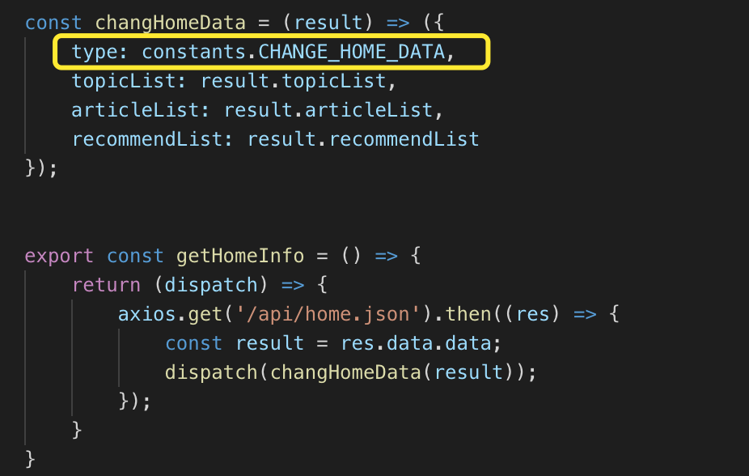
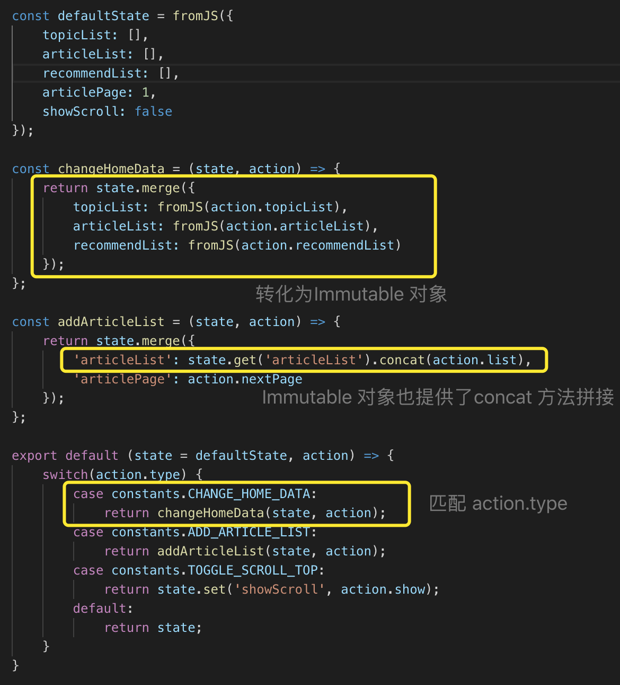
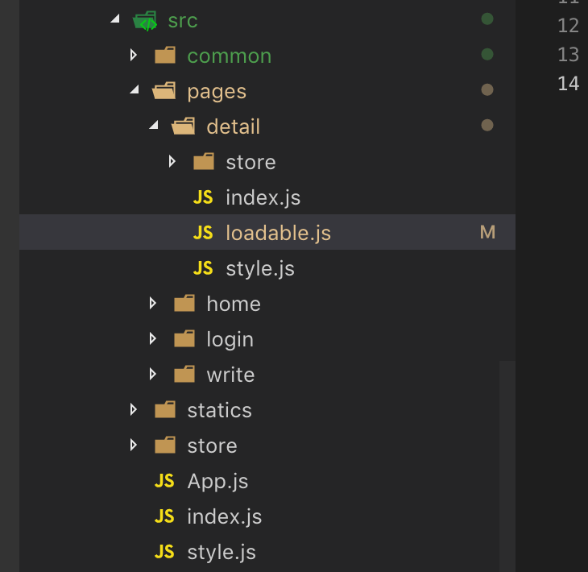
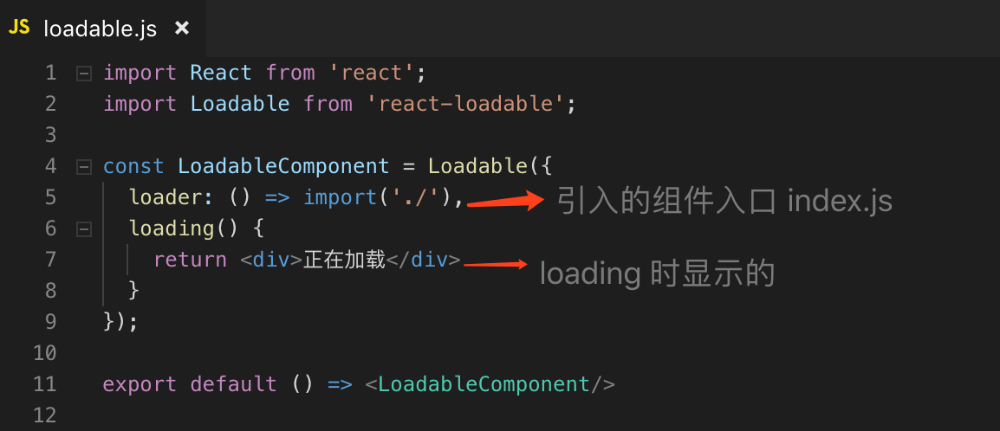
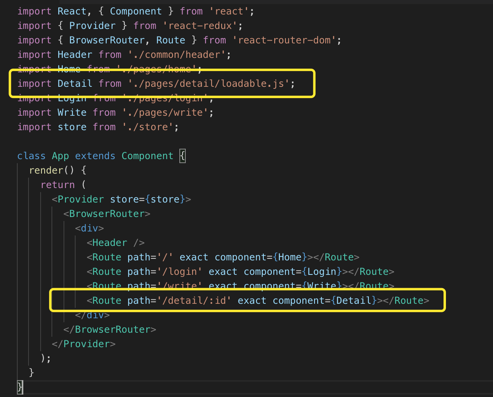

# Libs with React

## 使用 styled-components

使用这个第三方工具来写 css，好处是可以组件化。

文档：[https://github.com/styled-components/styled-components](https://github.com/styled-components/styled-components)

```jsx
import { injectGlobal } from "styled-components";
import styled from "styled-components";
import logoPic from "../../statics/logo.png";

// 注入全局样式
injectGlobal`
    body {
        ...
    }
`;
// div标签
export const HeaderWrapper = styled.div`
    height: 56px;
    .topic-pic {
        display: block;
    }
    &.same-level-HeaderWrapper {
      ...
    }
`;
// a 标签上的属性，及引用图片
export const Logo = styled.a.attrs({
  href: "/"
})`
      background: url(${logoPic});
      background-size: contain;
`;
```

```jsx
// JSX 中直接使用，也可以额外增加类名
<HeaderWrapper>
    <Logo className="" />
</HeaderWrapper>
```

### 怎样接收外部变量？

因为它的本质是一个 StyledComponent 对象组件，从组件外部接收变量，就和正常的 React 一样传递，在 style.js 里用 props 接收：

```jsx{9}
import { RecommendWrapper, RecommendItem } from '../style';

class Recommend extends Component {
  render() {
    return (
      <RecommendWrapper>
        {this.props.list.map(item => {
          return (
            <RecommendItem imgUrl={item.imgAddress} key={item.id)} />
          );
        })}
      </RecommendWrapper>
    );
  }
}

// ...
```

```jsx{6}
import styled from "styled-components";

export const RecommendItem = styled.div`
  width: 280px;
  height: 50px;
  background: url(${props => props.imgUrl});
  background-size: contain;
`;
```

### StyledComponent 对象

一个元素是 styled-components 渲染出来的话，那它是 StyledComponent 对象。

用 ref 去获取只能获取到 StyledComponent 对象而不是 DOM。

```jsx{6,13}
import { LoginBox } from "./style";
// ...
<LoginBox>
  <Input
    placeholder="账号"
    ref={input => {
      this.account = input;
    }}
  />
  <Input
    placeholder="密码"
    type="password"
    ref={input => {
      this.password = input;
    }}
  />
  <Button onClick={() => this.props.login(this.account, this.password)}>
    登陆
  </Button>
</LoginBox>;
// ...
```


这时候可以使用 styled-components 提供的 innerRef ，就可以获取到真实 DOM。

```jsx{6,13}
import { LoginBox } from "./style";
// ...
<LoginBox>
  <Input
    placeholder="账号"
    innerRef={input => {
      this.account = input;
    }}
  />
  <Input
    placeholder="密码"
    type="password"
    innerRef={input => {
      this.password = input;
    }}
  />
  <Button onClick={() => this.props.login(this.account, this.password)}>
    登陆
  </Button>
</LoginBox>;
// ...
```

## action 归属问题

在 Header 组件里，要执行 Login 组件相关的 action。我们的原则应该是去调用 Login 中的 action，每个组件的 action 只做和自己组件相关的数据处理。

/src/common/header/index.js


## API - combineReducers

当 reducer 的数量越来越多时，逻辑全放在一个 /src/store/reducer.js 里去操作显然不合理，于是要继续拆分：将属于某个组件相关的 reducer 操作，放在这个组件相关的 reducer.js 里去做，全局的 /src/store/reducer.js 只负责组织和管理各个组件的 reducer 操作。

**redux 的 combineReducers 便提供了合并各个组件 reducer 的功能。**

引入了和 Header 组件 以及 Home 组件 相关的 reducer 操作。

```jsx{6}
// /src/store/reducer.js
import { combineReducers } from "redux";
import { reducer as headerReducer } from "../common/header/store";
import { reducer as homeReducer } from "../pages/home/store";

const reducer = combineReducers({
  header: headerReducer,
  home: homeReducer
});

export default reducer;
```

具体的组件中，如 Header 组件，在 store 目录下以 index.js 做一个出口文件。

```jsx
// /src/common/header/store/index.js
import reducer from "./reducer";
import * as actionCreators from "./actionCreators";
import * as constants from "./constants";

export { reducer, actionCreators, constants };
```

对于跟 header 组件相关的 reducer 操作，放到相关目录的 reducer.js 这里来做。

```jsx
// /src/common/header/store/reducer.js
import { SEARCH_FOCUS } from "./constants";

const defaultState = {
  focused: false
};

export default (state = defaultState, action) => {
  switch (action.type) {
    case SEARCH_FOCUS:
      return {
        ...state,
        focused: action.value
      };
    default:
      return state;
  }
};
```

在 Header 组件里引用 Store 里的 state 值，便要改成 state.header 。

```jsx{6}
// /src/common/header/index.js
// ...
const mapStateToProps = state => {
  return {
    // focused: state.focused
    focused: state.header.focused
  };
};
// ...
```

### 关于 **combineReducers** 合并多个小的 reducer 后 dispatch 的接收问题？

dispatch 的时候，不仅是全局大的 reducer 可以接收到 dispatch，小的组件的 reducer 也可以接收到 dispatch，所以可以直接在小的组件的 reducer 里去匹配 action.type，再做逻辑处理。

## Immutable

### 使用 Immutable.js 来管理 store 中的数据

为了避免 state 被外部直接更改，facebook 出了这个库，将 JS 转变成 Immutable 对象，以确保没有错误更改了 Store 里的 state 值，如：在 reducer 里直接修改了 state 的值。

文档：[https://github.com/facebook/immutable-js](https://github.com/facebook/immutable-js)

API：

**fromJS** 将 JS 对象转化成一个 Immutable 对象。

**toJS()** 将 Immutable 对象转化成一个 JS 对象。

```jsx{3,6,15,17}
// /src/common/header/store/reducer.js
import * as constants from "./constants";
import { fromJS } from "immutable";

// 将 defaultState 对象转化为一个 Immutable 对象
const defaultState = fromJS({
  focused: false
});

export default (state = defaultState, action) => {
  switch (action.type) {
    case constants.SEARCH_FOCUS:
      // immutable对象的 set 方法，会结合之前immutable对象的值
      // 和设置的值，返回一个全新的对象
      return state.set("focused", true);
    case constants.SEARCH_BLUR:
      return state.set("focused", false);
    default:
      return state;
  }
};
```

**用 fromJS 方法将原来只是一个 JS 对象的 defaultState 转变成一个 Immutable 对象，然后下面的 state 因为被转变成 Immutable 对象了。**

**所以取值的时候不能再像取 JS 的对象的值一样用 `点(.)` 去取值，改成 Immutable 中的 `set()` 方法去设置。**

这个方法实质上也没有直接修改 state 的值，而是结合设置的值后，返回一个新的对象给 Store。

因为 state.header 已经转变成 Immutable 对象，所以不能用`点(.)`取值，使用 `get()` 方法。

```jsx{5}
// /src/common/header/index.js
const mapStateToProps = state => {
  return {
    // 这里的写法很奇怪，先取普通对象state.header的值，再取Immutable对象的值
    focused: state.header.get("focused")
  };
};
// ...
```

但是这种写法很奇怪，全局的 state 还是 JS 对象，但是 state.header 是 Immutable 对象，所以我们需要将它们统一，即用 **redux-immutable** 将全局的 state 也变成 Immutable 对象。

### 使用 redux-immutable 统一数据格式

文档：[https://github.com/gajus/redux-immutable](https://github.com/gajus/redux-immutable)

安装好 redux-immutable 后，将/src/store/reducer.js 原来的：

```jsx{1}
import { combineReducers } from "redux";
```

改成：

```jsx{2}
// /src/store/reducer.js
import { combineReducers } from "redux-immutable";
import { reducer as headerReducer } from "../common/header/store";
import { reducer as homeReducer } from "../pages/home/store";

const reducer = combineReducers({
  header: headerReducer,
  home: homeReducer
});

export default reducer;
```

即引入完成。

这时候全局的 state 也是 Immutable 对象了，所以可以 get() 直接取值。

Immutable 对象执行多个 get() 时，可以用 **getIn()** 来简化代码，性能也更好。

```jsx{4,5}
const mapStateToProps = state => {
  return {
    // 以下两种写法是等价的
    focused: state.get("header").get("focused"),
    focused: state.getIn(["header", "focused"])
  };
};
```

Immutable 对象执行多个 set() 时，可以用 **merge()** 来简化代码，性能也更好。
下面两句是等价的：

```jsx{7,8,9,10,11}
// src/common/header/store/reducer.js
// ...
export default (state = defaultState, action) => {
  switch (action.type) {
    case constants.CHANGE_LIST:
      // 下面两句是等价的：
      return state.set("list", action.data).set("totalPage", action.totalPage);
      return state.merge({
        list: action.data,
        totalPage: action.totalPage
      });
    default:
      return state;
  }
};
// ...
```

### immutable 对象的循环展示

```jsx{16,18,19}
import React, { Component } from "react";
import { ListItem, ListInfo, LoadMore } from "../style";
import { connect } from "react-redux";
import { actionCreators } from "../store";

class List extends Component {
  render() {
    // 从 Store 里解构赋值
    const { list, getMoreList, page } = this.props;
    return (
      <div>
        {list.map((item, index) => {
          return (
            <ListItem key={index}>
              {/* item 是 Immutable对象，所以直接 get() 方法从 state 里取值 */}
              
              <ListInfo>
                <h3 className="title">{item.get("title")}</h3>
                <p className="desc">{item.get("desc")}</p>
              </ListInfo>
            </ListItem>
          );
        })}
        <LoadMore onClick={() => getMoreList(page)}>更多文字</LoadMore>
      </div>
    );
  }
}
```

```jsx
// ...
const mapState = state => ({
  list: state.getIn(["home", "articleList"]),
  page: state.getIn(["home", "articlePage"])
});

const mapDispatch = dispatch => ({
  getMoreList(page) {
    dispatch(actionCreators.getMoreList(page));
  }
});

export default connect(
  mapState,
  mapDispatch
)(List);
```

### immutable 对象和数组对象

axios 接收到的数据里的数组不是 immutable 对象，但是 state 里的数组对象都已经变成了 immutable 对象，若是需要把数据给 state 里的数组对象，要把数组对象转化为 immutable 对象。

```jsx{5,6,7,8,9,10,18}
// /src/pages/home/store/actionCreators.js
import axios from "axios";
import * as constants from "./constants";

const changHomeData = result => ({
  type: constants.CHANGE_HOME_DATA,
  topicList: result.topicList,
  articleList: result.articleList,
  recommendList: result.recommendList
});

export const getHomeInfo = () => {
  return dispatch => {
    // axios 接收到的数据里的数组不是 immutable 对象
    axios.get("/api/home.json").then(res => {
      const result = res.data.data;
      // 所以dispatch给changHomeData的result在 reducer 那边需要转化为 immutable 对象
      dispatch(changHomeData(result));
    });
  };
};
```

在 merge 的时候，使用 fromJS 将它们转化为 immutable 对象。


```jsx{15,16,17,25}
// /src/pages/home/store/reducer.js
import { fromJS } from "immutable";
import * as constants from "./constants";

const defaultState = fromJS({
  topicList: [],
  articleList: [],
  recommendList: [],
  showScroll: false
});

const changeHomeData = (state, action) => {
  return state.merge({
    // 接受到的actionCreators传过来的普通对象，转化为 immutable 对象，再去 merge()
    topicList: fromJS(action.topicList),
    articleList: fromJS(action.articleList),
    recommendList: fromJS(action.recommendList)
  });
};

export default (state = defaultState, action) => {
  switch (action.type) {
    case constants.CHANGE_HOME_DATA:
      // 接收到 actionCreators.js dispatch 过来的操作
      return changeHomeData(state, action);
    case constants.TOGGLE_SCROLL_TOP:
      return state.set("showScroll", action.show);
    default:
      return state;
  }
};
```


## redux-thunk 的应用

作为中间件，可以先 dispatch 出一个函数去做 axios 请求数据处理，得到数据后再去 dispatch。

像这样的形式：

```jsx
dispatch(Function() {
  dispatch()
})
```

/src/pages/home/index.js


/src/pages/home/store/actionCreators.js


/src/pages/home/store/reducer.js


## PureComponent

当组件都 connect 之后，一旦 state 发生了变化，所有 connect 的组件都会重新渲染，性能低。

react fiber 中提供了一个 PureComponent ，它在底层实现了自动比对虚拟 DOM 功能，使用它可以让我们不用一个个组件的去写**shouldComponentUpdate**去对比内容的变化，再决定是否更新。用法只需要将 PureComponent 去替换 Component 即可。但是使用这个 PureComponent 最好结合着 Immutable.js 一块使用，不然容易有坑。

文档：[React - PureComponent](https://reactjs.org/docs/react-api.html#reactpurecomponent)

## 组件分包加载

文档：[https://github.com/jamiebuilds/react-loadable](https://github.com/jamiebuilds/react-loadable)

分包加载的结构（这里只分包加载 Detail 组件）：


在要分包加载的组件 Detail 组件文件夹里创建 loadable.js


然后在路由的地方引入
