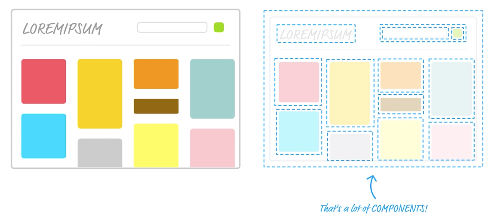
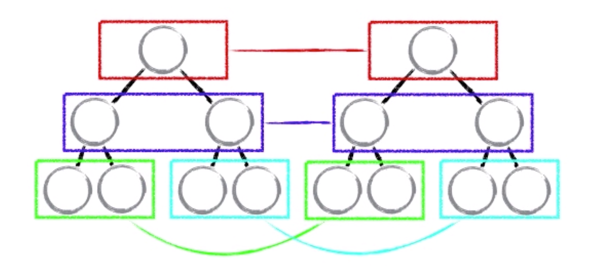

# React 基础部分

React Fiber 是指 16 版本，或者是 16 版本中的一些底层实现。

## 关于 React 脚手架中 PWA 的部分

```js
// index.html
<link rel="manifest" href="%PUBLIC_URL%/manifest.json">
<link rel="shortcut icon" href="%PUBLIC_URL%/favicon.ico">

// index.js
import registerServiceWorker from "./registerServiceWorker";
registerServiceWorker();

// manifest.json
{
  "short_name": "React App",
  "name": "Create React App Sample",
  "icons": [
    {
      "src": "favicon.ico",
      "sizes": "64x64 32x32 24x24 16x16",
      "type": "image/x-icon"
    }
  ],
  "start_url": "./index.html",
  "display": "standalone",
  "theme_color": "#000000",
  "background_color": "#ffffff"
}
```

## 组件化



```js
import { Component } from "react";
// 等价于
import React from "react";
const Component = React.Component;
```

## React 中的响应式设计思想和事件绑定

在原生 JS 中 **onchange**，在 JSX 中是 **onChange**

```js {8}
constructor(props) {
  super(props);
  this.handleInputChange = this.handleInputChange.bind(this);
  // ...
}

<input
  onChange={this.handleInputChange}
>

handleInputChange(e) {
  const value = e.target.value;
  this.setState(() => ({
      inputValue: value
  }));
}
```

**bind()**  函数会创建一个新**绑定函数**，**绑定函数**与被调函数具有相同的函数体。下例是解释：

```js
var module = {
  x: 42,
  getX: function() {
    return this.x;
  }
};

var unboundGetX = module.getX;
console.log(unboundGetX()); // The function gets invoked at the global scope
// expected output: undefined

var boundGetX = unboundGetX.bind(module);
console.log(boundGetX()); // 42
```

### 展开运算符用法 ...this.state.list

```js {7}
this.state = {
  inputValue: '',
  list: ['1','2','3']
}
handleBtnClick() {
  this.setState(() => ({
    list: [...this.state.list, this.state.inputValue],
    // 相当于 list: ['1','2','3',this.state.inputValue]
  }));
}
```

### immutable 原则

```js {4}
handleItemDelete(index) {
  this.setState((prevState) => {
    // 复制一份副本给setState方法去更改state的值
    const list = [...prevState.list];
    list.splice(index, 1);
    return {list}
  });
}
```

immutable 不可变，我们不能直接去改变 state 的值，必须通过 setState 方法。

## JSX 语法细节补充

### JSX 里怎么写注释

```js
{
  /*推荐单行注释符号*/
}

{
  /*
    推荐多行行注释符号
    推荐多行行注释符号
  */
}
```

### 为什么在 JSX 里用 className 而不是 class ?

在 JSX 里，css 的 class 关键字容易和类声明 class 混淆，所以用 className。

### 为什么在 JSX 里 label 的属性用 htmlFor 而不是 for ?

```jsx {1,8}
for (let index = 0; index < array.length; index++) {
  const element = array[index];
}
return (
  <Fragment>
    <div>
      {/* 错误的写法！*/}
      <label for="insertArea">输入内容</label>
      <input id="insertArea" />
    </div>
  </Fragment>
);
```

容易和 for 循环混淆。所以要用 htmlFor。

```jsx
<label htmlFor="insertArea">输入内容</label>
```

### dangerouslySetInnerHTML

```jsx {7}
class Detail extends Component {
  render() {
    return (
      <DetailWrapper>
        <Header>{this.props.title}</Header>
        {/*直接显示 this.props.content 中的值*/}
        <Content dangerouslySetInnerHTML={{ __html: this.props.content }} />
      </DetailWrapper>
    );
  }
}
```

不转义，直接显示 HTML 元素内容。
这样容易受到造成 XSS 攻击。
官方的解释：[https://reactjs.org/docs/dom-elements.html](https://reactjs.org/docs/dom-elements.html)

## 父子组件传值

父组件传给子组件：

```jsx
// 父组件：
<TodoItem content={item} />

// 子组件：
<div>
  {this.props.content}
</div>
```

子组件调用父组件的方法：

```jsx {10}
// 父组件
// ...
<ul>
  {this.state.list.map((item, index) => {
    return (
      <div>
        <TodoItem
          content={item}
          index={index}
          deleteItem={this.handleItemDelete.bind(this)}
        />
      </div>
    );
  })}
</ul>
// ...

// 删除list的index项
handleItemDelete(index) {
  this.setState(prevState => {
    const list = [...prevState.list];
    list.splice(index, 1);
    return { list };
  });
}
```

将父的 handleItemDelete 方法传给子，子再进行调用。

注意要将 handleItemDelete 方法 bind 到父的 this 上，不然子再调用的时候会 undefined.

```jsx {11}
// 子组件
class TodoItem extends Component {
  constructor(props) {
    super(props);
    this.handleClick = this.handleClick.bind(this);
  }
  render() {
    return <div onClick={this.handleClick}>{this.props.content}</div>;
  }
  handleClick() {
    this.props.deleteItem(this.props.index);
  }
}
```

## 上述代码优化

解构赋值。

```jsx {8,9,13,14}
class TodoItem extends Component {
  constructor(props) {
    super(props);
    this.handleClick = this.handleClick.bind(this);
  }

  render() {
    const { content } = this.props;
    return <div onClick={this.handleClick}>{content}</div>;
  }

  handleClick() {
    const { deleteItem, index } = this.props;
    deleteItem(index);
  }
}
```

setState()
推荐写法：对象变成函数，返回一个对象。

```jsx {5}
handleInputChange(e) {
  // 变成函数后，e.target.value 变成异步的，inputValue 可能没值。
  // 所以，用一个 const 保存再赋值。
  const value = e.target.value;
  this.setState(() => ({
    inputValue: value
  }));
}
```

prevState 修改数据前的那个 state 的值，这样写可以更好的避免误改 state 值

```jsx {3,4,10,11}
// 原来的
handleBtnClick() {
  this.setState(() => ({
    list: [...this.state.list, this.state.inputValue],
    inputValue: ""
  }));
}
// 优化的
handleBtnClick() {
  this.setState(prevState => ({
    list: [...prevState.list, prevState.inputValue],
    inputValue: ""
  }));
}
```

```jsx
// 原来的
handleItemDelete(index) {
  const list = [...this.state.list];
  list.splice(index, 1);
  this.setState({
    list: list
  });
}
// 优化的
handleItemDelete(index) {
  this.setState((prevState) => {
    const list = [...prevState.list];
    list.splice(index, 1);
    return {list}
  });
}
```

## PropTypes 与 DefaultProps 的应用

引入：

```jsx
import PropTypes from "prop-types";
```

定义 TodoItem 类的类型声明：

```jsx
TodoItem.propTypes = {
  test: PropTypes.string.isRequired,
  content: PropTypes.arrayOf(PropTypes.number, PropTypes.string),
  deleteItem: PropTypes.func,
  index: PropTypes.number
};

TodoItem.defaultProps = {
  test: "hello world"
};
```

1.propTypes 对属性进行强校验，验证格式是否正确（number，string，func 等），isRequired 是必须要传的意思，不能不传。

2.defaultProps 设置默认的属性值

类型定义希望它可能是两种类型：

```jsx
optionalArrayOf: PropTypes.oneOfType([PropTypes.number,PropTypes.string]),
```

详细用法：[https://reactjs.org/docs/typechecking-with-proptypes.html](https://reactjs.org/docs/typechecking-with-proptypes.html)

## props，state 与 render 函数的关系

1. 当组件的 state 或者 props 发生改变的时候，render 函数就会重新执行。

2. 当父组件的 render 函数被运行时，它的子组件的 render 都将被重新运行一次。

## React 中的虚拟 DOM 的生成过程

**普通方案一：**

1. state 数据
2. JSX 模版
3. 数据 + 模版 结合，生成真实的 DOM，来显示在页面中
4. 当 state 发生改变
5. 数据 + 模版 结合，生成真实的 DOM，替换原始的 DOM

缺陷：

1. 第一次生成了一个完整的真实 DOM 片段。
2. 第二次生成了一个完整的真实 DOM 片段。
3. 第二次的真实 DOM 替换第一次的真实 DOM，非常耗性能。

**普通方案二：**

1. state 数据
2. JSX 模版
3. 数据 + 模版 结合，生成真实的 DOM，来显示在页面中
4. 当 state 发生改变
5. 数据 + 模版 结合，生成真实的 DOM，并不直接替换原始的 DOM
6. 而是新的 DOM（DoucumentFragment） 和原始的 DOM 做比对，找差异
7. 找出 input 框发生了变化
8. 只用新的 DOM 中的 input 元素，替换掉老的 DOM 中的 input 元素

缺陷：
性能的提升并不明显

**React 中的做法**

1. state 数据
2. JSX 模版
3. 数据 + 模版 生成虚拟 DOM（虚拟 DOM 就是一个 JS 对象，用它来描述真实 DOM）（损耗了一点性能）

`['div', {id: 'abc'}, ['span', {}, 'hello world']]`

4. 用虚拟 DOM 的结构生成真实的 DOM，来显示在页面中。

`<div id='abc'><span>hello world</span></div>`

5. 当 state 发生变化
6. 数据 + 模版 生成新的虚拟 DOM （极大的提升了性能）

`['div', {id: 'abc'}, ['span', {}, 'bye bye']]`

7. 比较原始虚拟 DOM 和新的虚拟 DOM 的区别，找到区别是 span 中内容（极大的提升性能）
8. 直接操作真实 DOM，改变 span 中的内容

**状态改变后：生成的是新的虚拟 DOM 而不是真实 DOM，以及对比的是虚拟 DOM 而不是真实 DOM，所以性能极大提升。**

## 深入了解虚拟 DOM

```jsx
render() {
  // JSX -> createElemnt ->  虚拟DOM（JS 对象） -> 真实的DOM
  return <div><span>item</span></div>
  return React.createElement('div', {}, React.createElement('span', {}, 'item'));
}
```

以上两个 return 是等同写法。

React.createElement() 第一个参数是 DOM 节点，第二个参数是 DOM 节点上的属性如 id，第三个参数是 DOM 节点里的内容。

虚拟 DOM 的好处：

1. 性能的极大提升。
2. 使得可以用 React Native 去写原生应用。因为原生应用里是没有 DOM 这种概念的，但是通过虚拟 DOM 可以去转化成原生应用的语法。

## 虚拟 DOM 中的 Diff 算法

### setState()为什么要设置成异步函数？

为了提升性能，例如将连续的三次 setState 执行合并成一次，只需要对比一次虚拟 DOM，节省了两次的消耗。同步的话就会执行三次对比。


### diff 算法 - 同层虚拟 DOM 比对


同层比对算法简单，比对速度快。
假如虚拟 DOM 的对比中，红框中的节点对比发现不同，则**直接把旧的真实 DOM 红框节点下的元素全删除，再重新渲染为新的虚拟 DOM 中的内容**。
虽然可能会造成 DOM 重新渲染时的浪费，但是它大大减少了两个虚拟 DOM 比对算法之间的性能消耗。

### 为什么不推荐循环中设置 index 为 key？


所以为什么说不要设置循环中的 key 值为 index，因为这样就没法保证新生成的虚拟 dom 上的 key 和旧的虚拟 dom 上的 key 是同一个值了。这样在新旧虚拟 DOM 对比时的造成了难度的提升。

## React 中的 Ref

### 什么是 Ref？

Ref 具有获取 DOM 节点的能力。

```jsx {5}
<input
  id="insertArea"
  value={this.state.inputValue}
  onChange={this.handleInputChange}
  ref={input => {
    this.input = input;
  }}
/>
```

this.input 被赋值为 input 参数，这个 input 参数就是由 ref 绑定的 DOM 节点`<input />`。
所以 this.input 指向的就是 DOM 节点`<input />`。

```jsx {3}
handleInputChange() {
  // const value = e.target.value;
  const value = this.input.value;
  this.setState(() => ({
    inputValue: value
  }));
}
```

所以原先的 e.target 可以用 this.input（ref 获取到的 DOM 节点） 替换。

**但是要注意，React 是不推荐我们使用 Ref 的，React 倡导的是数据驱动的方式。**

### setState() 和 Ref 一块使用中的小坑

如下有一个 `<ul />`，我们用 ref 获取到它的 DOM 节点(this.ul)。

```jsx
<ul
  ref={ul => {
    this.ul = ul;
  }}
/>
```

```jsx {6}
handleBtnClick() {
  this.setState(prevState => ({
    list: [...prevState.list, prevState.inputValue],
    inputValue: ""
  }));
  console.log(this.ul.querySelectorAll("div").length);
}
```

我们 console.log 输出获取到的 DOM 的长度总是滞后不正确的，原因是因为 setState 是异步函数，而 console.log 是同步执行的。

所以应该写在 setState 提供的第二个参数，即它提供的回调方法中，这样就可以确保 setState 异步执行完后，再输出 DOM 节点的真实长度。

```jsx {7,8,9}
handleBtnClick() {
  this.setState(
    prevState => ({
      list: [...prevState.list, prevState.inputValue],
      inputValue: ""
    }),
    () => {
      console.log(this.ul.querySelectorAll("div").length);
    }
  );
}
```

## React 的生命周期函数


### initialization 阶段：

就是 constructor() 构造函数执行的阶段。

### Mounting 阶段：

**componentWillMount** 在组件即将被挂载到页面的时刻自动执行。（只会被执行一次）

**render** 前面说过，在 state 或者是 props 更新的时候会自动执行。

**componentDidMount** 组件被挂载到页面之后，自动被执行。（只会被执行一次）

### Updation 阶段：

**shouldComponentUpdate** 组件被更新之前， 它会自动被执行，并要求返回 true 或 false。
假如返回的是 false，那组件则不会被更新，图中下方的流程都不会被执行了。

```jsx
shouldComponentUpdate() {
  console.log('shouldComponentUpdate');
  return true; // 允许组件更新
}
```

**componentWillUpdate（新版废弃的）**

```jsx
// 组件被更新之前，它会自动执行，但是他在shouldComponentUpdate之后被执行，
// 如果shouldComponentUpdate返回 true 它才执行
// 如果返回false，这个函数就不会被执行了
componentWillUpdate() {
  console.log('componentWillUpdate');
}
```

**render** 前面说过，在 state 或者是 props 更新的时候会自动执行。

**componentDidUpdate**

```jsx
// 组件更新完成之后，他会被执行
componentDidUpdate() {
  console.log('componentDidUpdate');
}
```

**componentWillReceiveProps（新版废弃的）**

一个组件要从父组件接受参数，

如果这个组件第一次存在于父组件中，不会执行。

如果这个组件之前已经存在于父组件中，才会执行。

（只要父组件的 render 函数被重新执行了，子组件的这个**componentWillReceiveProps**就会被执行。）

```jsx
componentWillReceiveProps() {
  console.log('child componentWillReceiveProps');
}
```

### Unmounting 阶段：

**componentWillUnmount**

```jsx
// 当这个组件即将被从页面中剔除的时候，会被执行
componentWillUnmount() {
  console.log('child componentWillUnmount');
}
```

### 一个问题

**删除子组件的流程：**


**Qusetion: 生命周期函数 componentWillUnmount 执行的时候，控制台是先输出了 parent render，然后才是 child componentWillUnmount。但是 parent render 执行完了之后，显示 DOM 的内容不是已经删除后的样子吗？这样的话，感觉是执行 omponentWillUnmount 后执行 parent render 才对。**

理解：在 parent render 完后，按理说是到 child render，但是因为 child 即将被删除，所以不需要重新再为 child 执行一次 render，而是直接 child componentwillUnmount，结束此次渲染。另外，render 永远在 componentWillUnmount 之前执行。

## React 生命周期函数的使用场景

### 父组件 render，子组件也会随之 render 的优化方案

写在子组件中，当父组件传来的值和当前的值不一样，才更新(true)。否则不更新。

```jsx
// 子组件
shouldComponentUpdate(nextProps, nextState) {
  if (nextProps.content !== this.props.content) {
    return true;
  } else {
    return false;
  }
}
render() {
  const { content } = this.props;
  return <div>{content}</div>;
}
```

### 约定：ajax 请求，放在 componentDidMount 里。

**Question: 从后台获取数据一定要放在 componentDidMount 里面调用，为什么不能在 constructor 或者 componentWillMount 里面调用？**

原因：这与 React 组件的生命周期有关，组件挂载时有关的生命周期有以下几个:

- constructor()
- componentWillMount()
- render()
- componentDidMount()

上面这些方法的调用是有次序的，由上而下，也就是当说如果你要获取外部数据并加载到组件上，只能在组件"已经"挂载到真实的网页上才能作这事情，其它情况你是加载不到组件的。

**constructor**被调用是在组件准备要挂载的最一开始，所以此时组件尚未挂载到网页上。

**componentWillMount**方法的调用在 constructor 之后，在 render 之前，在这方法里的代码调用 setState 方法不会触发重渲染，所以它一般不会用来作加载数据之用，它也很少被使用到。

**componentDidMount**方法中的代码，是在组件已经完全挂载到网页上才会调用被执行，所以可以保证数据的加载。此外，在这方法中调用 setState 方法，会触发重渲染。所以，官方设计这个方法就是用来加载外部数据用的，或处理其他的副作用代码。

一般的从后台(服务器)获取的数据，都会与组件上要用的数据加载有关，所以都在 componentDidMount 方法里面做。虽然与组件上的数据无关的加载，也可以在 constructor 里作，但 constructor 是作组件 state 初绐化工作，并不是设计来作加载数据这工作的，所以所有有副作用的代码都会集中在 componentDidMount 方法里。

## 使用 Charles 实现本地数据 mock


如果不打算在代码里写反向代理的话，可以用这款软件做代理。

tools - map local 选项，如上个图配置。

ajax 打接口`http://localhost:3000/api/todolist`的话，Charles 会把桌面上的 todolist.json 中的内容做代理返回。

## 使用 react-transition-group 实现动画

官方文档：[http://reactcommunity.org/react-transition-group/](http://reactcommunity.org/react-transition-group/)

```jsx
import { CSSTransition, TransitionGroup } from "react-transition-group";
```

```jsx
<TransitionGroup>
  {this.state.list.map((item, index) => {
    return (
      <CSSTransition
        timeout={1000}
        classNames="fade"
        unmountOnExit
        onEntered={el => {
          el.style.color = "blue";
        }}
        appear={true}
        key={index}
      >
        <div>{item}</div>
      </CSSTransition>
    );
  })}
</TransitionGroup>
```
