# 从 0 实现 React SSR

## 什么是服务端渲染？

SSR：服务器把页面要展示的内容提前渲染好，直接返回给客户端去展示。

SSR 缺点：很消耗服务器的性能。

CSR（Client Server Render）客户端渲染：由客户端来渲染页面内容。

CSR 缺点：TTFP 首屏展现时间慢，对 SEO 不友好。

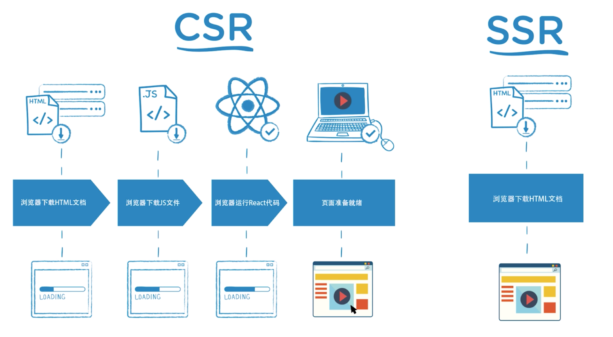

CSR 首屏渲染时间不如 SSR。

CSR 的 SEO 效果不如 SSR。（因为爬虫只能读取到 html 中的文本内容，读取不到 JS 里的内容，而 CSR 是由 JS 执行后渲染页面内容。）

## 在服务器端编写 React 组件

用 React 进行的客户端渲染，页面访问的执行顺序：
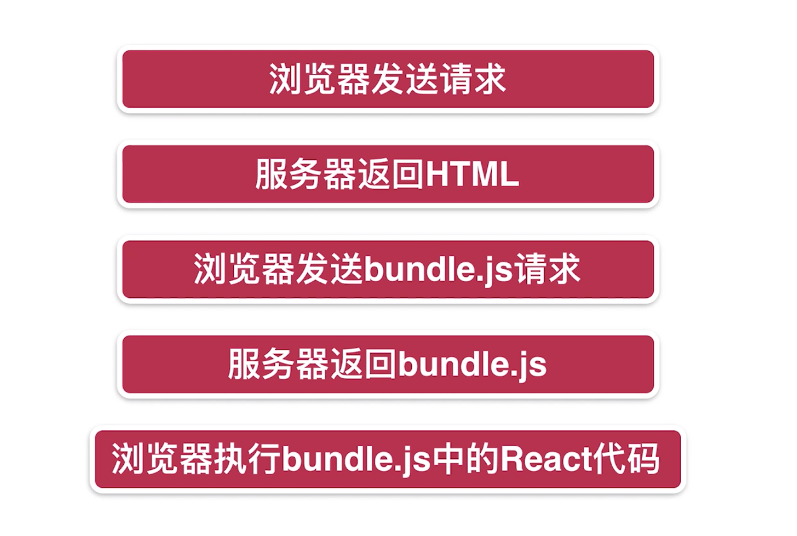

在服务器端写 React ，页面访问的执行顺序：


Node 环境下不遵从 **ESModule** 的写法，而遵从 **common.js** 的写法。
所以不能写

```jsx
import React from "react";
const Home = () => {
  return <div>home</div>;
};
export default App;
```

而是要 **common.js** 的写法：

```jsx
const React = require("react");
// 需要 webpack 编译打包好 JSX 语法内容才能用
const Home = () => {
  return <div>home</div>;
};
module.exports = {
  default: Home
};
```

但我们可以通过 webpack 编译打包，来使我们依然使用 **ESModule** 的写法。

## 编写 webpack 4 的配置文件

安装 webpack cli: [https://github.com/webpack/webpack-cli](https://github.com/webpack/webpack-cli)

```bash
npm install --save-dev webpack-cli
yarn add webpack-cli --dev
```

### Babel

```jsx
//  /webpack.server.js;
const path = require("path");
const nodeExternals = require("webpack-node-externals");

module.exports = {
  // 指定target是node环境，原因是例如const path = require('path');
  // 在node环境下不会将整个path包全部引入，而在客户端环境（需要）会将整个path包全部引入。
  // 所以需要声明。
  target: "node", // webpack4要求要声明mode环境
  mode: "development",
  entry: "./src/index.js",
  output: {
    filename: "bundle.js",
    // __dirname 指的是服务器端的根路径
    // 打包后的文件放到根路径下的 build 文件夹
    path: path.resolve(__dirname, "build")
  },
  // 运行 nodeExternals
  externals: [nodeExternals()],
  module: {
    rules: [
      {
        test: /\.js?$/,
        // 要使用 babel-loader，还需要安装它的核心库 babel-core
        // npm install babel-loader babel-core --save
        loader: "babel-loader",
        exclude: /node_modules/,
        options: {
          // 需要安装babel-preset-react来使得babel-loader能编译react代码
          // babel-preset-stage-0,babel-preset-env是辅助编译react的
          // 都需要安装
          presets: [
            "react",
            "stage-0",
            // 打包编译时，babel会去兼容所有主流浏览器的最后两个版本
            // 需要安装 npm install babel-preset-env --save 来设置env变量
            [
              "env",
              {
                targets: {
                  browsers: ["last 2 versions"]
                }
              }
            ]
          ]
        }
      }
    ]
  }
};
```

使用下面这条命令，使 webpack 用我们指定的配置文件进行打包。

```bash
$ webpack --config webpack.server.js
```

运行可能会报如下警告：

在服务器端除了要声明 target: "node"，还需要安装 **webpack-node-externals**，使得代码中引入的第三方的库（如 koa、express）不被打包进 bundled.js 里，还是会在 node modules 中加载。

文档：[https://github.com/liady/webpack-node-externals](https://github.com/liady/webpack-node-externals)

### CSS

webpack css 客户端打包编译需要安装 style-loader 和 css-loader。

```bash
yarn add style-loader css-loader
```

在服务器渲染时，使用 style-loader 会报以下错误，因为服务端上没有 window 对象。
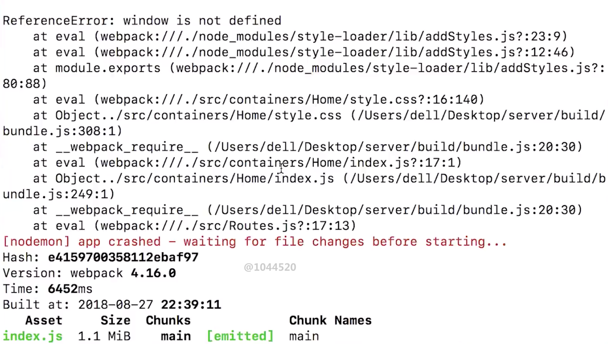

所以服务端渲染时，CSS 打包使用 isomorphic 来代替 style-loader。
[https://github.com/kriasoft/isomorphic-style-loader](https://github.com/kriasoft/isomorphic-style-loader)

分别配置客户端和服务端的 webpack 文件：

```js
// /webpack.client.js
const clientConfig = {
  mode: "development",
  entry: "./src/client/index.js",
  output: {
    filename: "index.js",
    path: path.resolve(__dirname, "public")
  },
  module: {
    rules: [
      {
        test: /\.css?$/,
        use: [
          "style-loader",
          {
            loader: "css-loader",
            options: {
              importLoaders: 1,
              modules: true,
              localIdentName: "[name]_[local]_[hash:base64:5]"
            }
          }
        ]
      }
    ]
  }
};
```

```jsx
// /webpack.server.js
const serverConfig = {
  target: "node",
  mode: "development",
  entry: "./src/server/index.js",
  output: {
    filename: "bundle.js",
    path: path.resolve(__dirname, "build")
  },
  externals: [nodeExternals()],
  module: {
    rules: [
      {
        test: /\.css?$/,
        use: [
          "isomorphic-style-loader",
          {
            loader: "css-loader",
            options: {
              importLoaders: 1,
              modules: true,
              localIdentName: "[name]_[local]_[hash:base64:5]"
            }
          }
        ]
      }
    ]
  }
};
```

但是这种做法也只是可以成功打包在服务端渲染时的 CSS 代码，页面上显示的还是客户端渲染的 CSS。想要服务端渲染时就把 CSS 代码打包好，参考下方的小节内容：**处理 SSR 框架中的 CSS 样式- 实现 CSS 样式的服务器端渲染。**

### Webpack 的自动打包与服务器自动重启

nodemon is a tool that helps develop node.js based applications by automatically restarting the node application when file changes in the directory are detected.

全局安装：

```bash
yarn global add nodemon
```

文档：[https://github.com/remy/nodemon](https://github.com/remy/nodemon)

配置新命令：
server/package.json

```json
"scripts": {
  "start": "nodemon --watch build --exec node \"./build/bundle.js\"",
  "build": "webpack --config webpack.server.js --watch"
},
```

webpack 命令追加 `--watch` 参数，意思是监听 webpack.server.js 配置的文件的变化，一旦发生变化就重新 build 打包一次代码。但是这只是重新打包了新的 bundled.js，并没有重启服务器，所以页面显示的还是旧的内容。所以我们需要配合着 nodemon 来使用。

start 命令的意思是 nodemon 监听 build 文件夹，一旦 build 文件夹发生了更改，就执行`node "./build/bundle.js"`命令，重启服务器。

### npm-run-all

上面自动打包和服务器自动重启是两条命令，需要两个终端窗口去分别执行，太麻烦，我们可以借助第三方工具使之合并为一个命令。

**全局安装 npm-run-all**

```bash
yarn global add npm-run-all
```

文档：[https://github.com/mysticatea/npm-run-all](https://github.com/mysticatea/npm-run-all)

改写命令，`npm-run-all --parallel dev:**` 的意思是，并行的执行所有以 dev: 开头的命令。

```json
"scripts": {
  "dev": "npm-run-all --parallel dev:**",
  "dev:start": "nodemon --watch build --exec node \"./build/bundle.js\"",
  "dev:build": "webpack --config webpack.server.js --watch"
},
```

### webpack-merge 优化

可以用 webpack-merge 去合并 webpack 中重复的配置项。

```js {31}
// /webpack.server.js
const path = require("path");
const nodeExternals = require("webpack-node-externals");
const merge = require("webpack-merge");
const config = require("./webpack.base.js");

const serverConfig = {
  target: "node",
  mode: "development",
  entry: "./src/server/index.js",
  output: {
    filename: "bundle.js",
    path: path.resolve(__dirname, "build")
  },
  externals: [nodeExternals()]
  // ...
};

module.exports = merge(config, serverConfig);
```

./webpack.base.js 导出一个对象，merge 方法去合并 config 对象和 serverConfig 对象。

## 实现服务器端组件渲染

原来客户端渲染的模式：

```jsx
import React from "react";
import ReactDOM from "react-dom";
import App from "./App";

ReactDOM.render(<App />, document.getElementById("root"));
```

在服务器端并不能直接 ReactDOM.render() 去取节点渲染。

但 react-dom 提供了服务器端渲染的方法：**renderToString** （将组件渲染成字符串返回）

```jsx {6,9,18}
// src/index.js
import express from "express";
import Home from "./containers/Home";
import React from "react";
// 在服务器端渲染 react 组件
import { renderToString } from "react-dom/server";

const app = express();
const content = renderToString(<Home />);

app.get("/", function(req, res) {
  res.send(`
		<html>
			<head>
				<title>ssr</title>
			</head>
			<body>
				${content}
			</body>
		</html>
  `);
});

var server = app.listen(3000);
```

**React 的虚拟 DOM 使得服务器渲染更简单，它是建立在虚拟 DOM 上的服务器端渲染，就是一个 JS 对象(虚拟 DOM)转成字符串返回去。**

## 同构的概念梳理

### 什么是同构？

一套 React 代码，在服务器端执行一次，在客户端再执行一次。
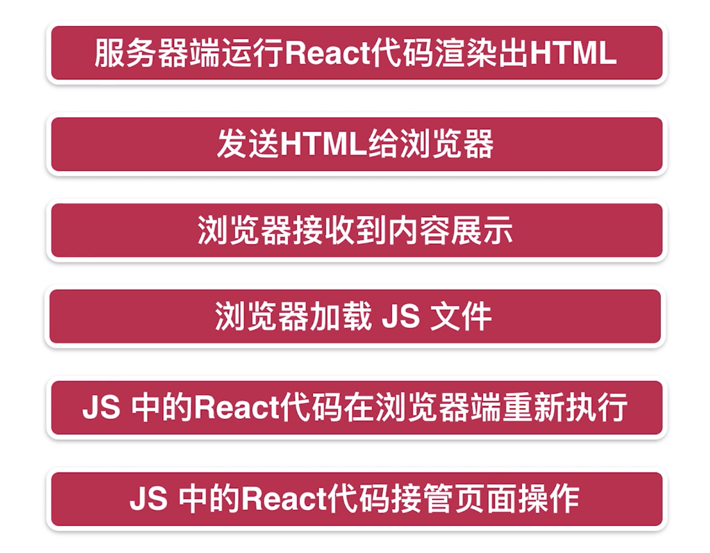

### 为什么要有同构？

假如我们想点击 button 时执行绑定在上面的 JS 语句，但服务器渲染时，组件上绑定的 JS 语句返回给客户端时会被删掉。

```jsx {8}
// src/containers/Home/index.js
import React from "react";

const Home = () => {
  return (
    <div>
      <div>This is HOME!</div>
      <button
        onClick={() => {
          alert("click1");
        }}
      >
        click
      </button>
    </div>
  );
};

export default Home;
```

```jsx
// src/index.js
import express from "express";
import React from "react";
import { renderToString } from "react-dom/server";
import Home from "../containers/Home";

const app = express();
app.use(express.static("public"));

const content = renderToString(<Home />);

app.get("/", function(req, res) {
  res.send(`
		<html>
			<head>
				<title>ssr</title>
			</head>
			<body>
				<div id="root">${content}</div>
			</body>
		</html>
  `);
});

var server = app.listen(3000);
```

如上面 button 的 alert 语句，渲染到页面时已被删除。因为 renderToString 方法只会渲染组件的基础内容，不会渲染事件。


为了解决这个问题，提出**同构**这种做法。

### 如何在浏览器上执行一段 JS 代码？

```jsx
// src/index.js
const app = express();
app.use(express.static("public"));
```

在 express 中提供了这样的方法，使用 use() 使用中间件，`express.static('public')` 意思是假如访问的是一个静态文件，就会到根目录下的 public 文件夹去获取静态资源。

并且我们在 webpack 配置了客户端的文件会被打包到 public 文件夹下，这样就有了解决的一种方式：

```jsx {10}
// ...
app.get("/", function(req, res) {
  res.send(`
		<html>
			<head>
				<title>ssr</title>
			</head>
			<body>
				<div id="root">${content}</div>
				<script src='/index.js'></script>
			</body>
		</html>
  `);
});
// ...
```

同构过程：访问 localhost:3000，可以获得服务器端渲染的内容，然后进行客户端的渲染。

在页面中的 `<script src='/index.js'></script>` 会引入 index.js 文件，并且执行里面的 JS 内容（客户端加载 JS）。

### 让 React 代码在浏览器上运行

> 同构思路：我们在 src 目录下新建一个 client 目录，专门存放客户端渲染要执行的代码（client/index.js），并且用 webpack.client.js 将其打包编译到根目录的 public 文件夹下。（浏览器里是不直接支持 esmodule 的写法的，所以要用 webpack 编译）

> 在服务端渲染完吐页面给浏览器后，浏览器会去执行 `<script src='/index.js'></script>` 访问 /index.js 文件，也就是直接访问 public 文件夹下的 index.js，浏览器就又重新加载了一次组件 Home，因为是客户端渲染的 Home，没有用到 renderToSring，JS 事件也都可以正常绑定上去了。

```jsx
// src/client/index.js
import React from "react";
import ReactDom from "react-dom";

import Home from "../containers/Home";

ReactDom.hydrate(<Home />, document.getElementById("root"));
```

这里要注意，同构的使用 ReactDom.hydrate `ReactDom.hydrate(<Home />, document.getElementById("root"));`

而不是`ReactDom.render(<Home />, document.getElementById("root"));`

这时候服务器渲染出的内容里，button 上依然是没有 js 语句的，但因为是客户端渲染时加载的 index.js 文件，使得 button 上的 click 语句正常执行了。


我们可以看到浏览器请求的先是服务器端返回的 localhost html，然后再请求加载的 index.js：


## 在 SSR 框架中引入路由机制

客户端的路由机制：
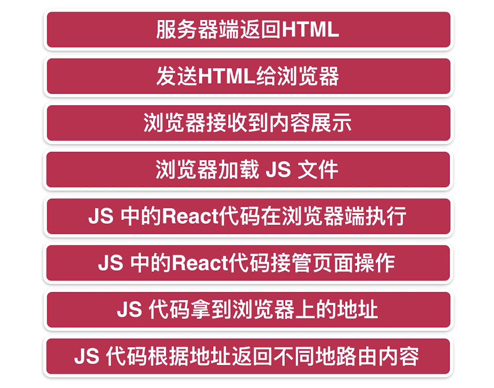

服务器端路由机制：
在客户端的路由机制是一样的。但是在服务器端就不一样了。

最大的区别是服务器端使用 **StaticRouter** ，而客户端使用 **BrowserRouter**。

文档：[https://reacttraining.com/react-router/web/api/StaticRouter](https://reacttraining.com/react-router/web/api/StaticRouter)

安装 react 路由：

```bash
yarn add react-router-dom
```

### 路由配置文件：
```jsx
// src/Routes.js
import React from "react";
import { Route } from "react-router-dom";
import Home from "./containers/Home";
import Login from "./containers/Login";

export default (
  <div>
    <Route path="/" exact component={Home} />
    <Route path="/login" exact component={Login} />
  </div>
);
```

### 客户端使用 BrowserRouter 进行客户端路由渲染：
```jsx {8}
// /src/client/index.js
import React from "react";
import ReactDom from "react-dom";
import { BrowserRouter } from "react-router-dom";
import Routes from "../Routes";

const App = () => {
  return <BrowserRouter>{Routes}</BrowserRouter>;
};

ReactDom.hydrate(<App />, document.getElementById("root"));
```

### 服务端的路由写法：
而服务器端由 express 监听所有路由路径，并且把要渲染的内容封装成一个 render 方法（优化策略）：
```jsx {8}
// src/server/index.js
import express from "express";
import { render } from "./utils";

const app = express();
app.use(express.static("public"));
// * 表示express 监听所有的路由路径
app.get("*", function(req, res) {
  res.send(render(req));
});

var server = app.listen(3000);
```

req 是 express 监听到路由变更时的一个大对象，其中 req.path 是当前 url 的 pathname。

```jsx {10}
// src/server/utils.js
import React from "react";
import { renderToString } from "react-dom/server";
import { StaticRouter } from "react-router-dom";
import Routes from "../Routes";

export const render = req => {
  const content = renderToString(
    // 服务器端 StaticRouter 无法监听到客户端的url路径，所以需要req.path传给location，以便知道当前的path
    <StaticRouter location={req.path} context={{}}>
      {Routes}
    </StaticRouter>
  );

  return `
    <html>
      <head>
        <title>ssr</title>
      </head>
      <body>
        <div id="root">${content}</div>
        <script src='/index.js'></script>
      </body>
    </html>
  `;
};
```

render 方法中使用 StaticRouter 进行服务器端路由渲染。

context 传递一个对象来通信。官方解释：A plain JavaScript object. During the render, components can add properties to the object to store information about the render. When a `<Route>` matches, it will pass the context object to the component it renders as the staticContext prop.

### 使用Link标签串起路由
```jsx
// src/components/Header.js
import React from "react";
import { Link } from "react-router-dom";
const Header = () => {
  return (
    <div>
      <Link to="/">Home</Link>
      <br />
      <Link to="/login">Login</Link>
    </div>
  );
};
export default Header;
```
引入组件点击即可跳转路由。

**服务器端渲染只发生在我们第一次进入页面的时候，之后页面由 React 代码接管，路由跳转都是客户端控制的，不会重新请求页面。**

## SSR 框架与 Redux 的结合
### 同构项目中引入 Redux

```jsx
// src/store/index.js
import { createStore, applyMiddleware } from "redux";
import thunk from "redux-thunk";

const defaultStore = {
  name: "Du"
};

const reducer = (state = defaultStore, action) => {
  return state;
};

const getStore = () => {
  return createStore(reducer, applyMiddleware(thunk));
};

export default getStore;
```

Q: 为什么 store 返回是以一个 getStore() 函数的方式？

A: 涉及到**单例**的问题，在服务器端直接返回一个 store 对象的话，那众多浏览器在访问的时候，都是读取的这一个对象，对服务器压力会很大。而返回一个函数的方式，使得 store 对象是在客户端生成，即多例的运用。

客户端引入

```jsx {11}
// src/client/index.js
import React from "react";
import ReactDom from "react-dom";
import { BrowserRouter } from "react-router-dom";
import { Provider } from "react-redux";
import getStore from "../store";
import Routes from "../Routes";

const App = () => {
  return (
    <Provider store={getStore()}>
      <BrowserRouter>{Routes}</BrowserRouter>
    </Provider>
  );
};

ReactDom.hydrate(<App />, document.getElementById("root"));
```

服务器端引入

```jsx {11}
// src/server/utils.js
import React from "react";
import { renderToString } from "react-dom/server";
import { StaticRouter } from "react-router-dom";
import Routes from "../Routes";
import { Provider } from "react-redux";
import getStore from "../store";

export const render = req => {
  const content = renderToString(
    <Provider store={getStore()}>
      <StaticRouter location={req.path} context={{}}>
        {Routes}
      </StaticRouter>
    </Provider>
  );

  return `
    <html>
      <head>
        <title>ssr</title>
      </head>
      <body>
        <div id="root">${content}</div>
        <script src='/index.js'></script>
      </body>
    </html>
`;
};
```

### 构建 Redux 代码结构

省略... 优化 redux 的工程目录。

**流程回顾：**

1. 服务器接收到请求，这个时候 store 是空的

2. 服务器端不会执行 componentDidMount，所以列表内容获取不到

3. 客户端代码运行，这个时候 store 依然是空的

4. 客户端执行 componentDidMount，列表数据被获取

5. store 中的列表数据被更新

6. 客户端渲染出 store 中 list 数据对应的列表内容

**componentDidMount 只会在客户端上执行，在服务端上不会执行**。所以页面的列表内容都是客户端渲染出来的。

接下来我们要让服务器端也能预先执行去获取数据，进行服务器端渲染，直接把获取到数据的页面返回来。

### 异步数据服务器渲染：loadData 方法及路由重构

文档：[https://reacttraining.com/react-router/web/guides/server-rendering](https://reacttraining.com/react-router/web/guides/server-rendering)

```jsx {6,10}
// src/server/utils.js
// ...
import getStore from '../store';

// 服务器端：在这里拿到异步的数据并填充到store，就可以在服务端渲染时有数据直接渲染
const store = getStore();

export const render = (req) => {
  const content = renderToString((
    <Provider store={store}>
      <StaticRouter location={req.path} context={{}}>
        {Routes}
      </StaticRouter>
    </Provider>
  ));

  return `
    <html>
      <head>
        <title>ssr</title>
      </head>
      <body>
        <div id="root">${content}</div>
        <script src='/index.js'></script>
      </body>
    </html>
  `;
// ...
```

想实现服务端渲染异步数据，那需要在服务端渲染前拿到异步数据。

store 里填充的是什么，我们需要结合当前用户请求的地址+路由来做判断。

如果用户访问 / 路径，我们就拿 / 路径对应的 Home 组件的异步数据给 store。

如果用户访问 /login 路径，我们就拿 /login 路径对应的 Loging 组件的异步数据给 store。

**第一步，在服务端渲染前，我们可以根据路由的不同来获取该路由所对应组件的异步数据，例如 Home 组件，loadData 方法用于获取该组件相关的数据。**

**第二步，获取到组件相关数据后，填充到 store 中，然后进行服务器端渲染。**

我们先来做第一步的内容。

```jsx
// src/containers/Home/index.js
class Home extends Component {
  // ...
}
Home.loadData = () => {
  // 这个函数，负责在服务器端渲染之前，把这个路由需要的数据提前加载好
};
```

为了实现 根据路由的不同来获取该路由所对应组件的异步数据，我们需要改造路由的写法。

原来的 server/src/Routes.js

```jsx
export default (
  <div>
    <Route path="/" exact component={Home} />
    <Route path="/login" exact component={Login} />
  </div>
);
```

react-router 提供了服务器端渲染所需方法，这时候Routes.js需要返回一个数组，里面的一个个对象对应着一个个路由。

改写后的 server/src/Routes.js

```jsx
// 当我加载显示HOME组件之前，我希望调用Home.loadData方法，提前获取到必要的异步数据
// 然后再做服务器端渲染，把页面返回给用户
export default [
  {
    path: "/",
    component: Home,
    exact: true,
    // 加载 Home 之前要执行的方法
    loadData: Home.loadData,
    key: "home"
  },
  {
    path: "/login",
    component: Login,
    exact: true,
    key: "login"
  }
];
```

当加载显示 HOME 组件之前，我们希望调用 Home.loadData 方法，提前获取到必要的异步数据。然后再做服务器端渲染，把页面返回给用户。

与之对应的还要去修改引用了路由的地方(因为原来返回 Route 对象，现在只返回了一个数组)。

```jsx {12}
// src/client/index.js
// ...
import routes from "../Routes";

const App = () => {
  return (
    <Provider store={getStore()}>
      <BrowserRouter>
        <div>
          {/*遍历生成新的Route组件*/}
          {routes.map(route => (
            <Route {...route} />
          ))}
        </div>
      </BrowserRouter>
    </Provider>
  );
};
// ...
```

**server/src/server/utils.js 同理。**

然后我们去修改服务器端渲染前的文件，使其能获取到用户当前访问的地址+路由。

```jsx {16}
// src/server/utils.js
// ...
import { StaticRouter, Route, matchPath } from "react-router-dom";
import routes from "../Routes";
import getStore from "../store";

export const render = req => {
  // 服务器端：在这里拿到异步的数据并填充到store，就可以在服务器端渲染时有数据一块渲染
  const store = getStore();

  // 根据路由的路径，来往store里面加数据
  const matchRoutes = [];
  // use 'some' to imitate '<Switch>' behavior of selecting only
  routes.some(route => {
    // matchPath: 当前路径req.path和route对象是否匹配，匹配返回true
    const match = matchPath(req.path, route);
    if (match) {
      matchRoutes.push(route);
    }
  });
// ...
```

react router 提供了 matchPath 方法，可以将当前路径和 route 对象进行匹配，匹配上则返回 true。

The **some()** method tests whether at least one element in the array passes the test implemented by the provided function.

假如我们访问的是根路径，打印输出 matchRoutes 数组，可以看到一个匹配上的 route 对象：
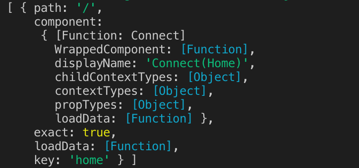

这样便可以知道用户访问的是哪个路由组件，**从而可以执行它的 loadData 方法，加载数据。**

### 多级路由问题的处理

matchPath 有个缺陷，不能捕获多级路由。

这时候我们可以借助 react-router-config 这个库的 matchRoutes 方法来代替。

文档：[https://github.com/ReactTraining/react-router/tree/master/packages/react-router-config](https://github.com/ReactTraining/react-router/tree/master/packages/react-router-config)

假设我们在 `/` 下新增一个子路由 `/subHome`：

```jsx
{
  path: '/',
    component: Home,
    loadData: Home.loadData,
    key: 'home',
    routes:[
      {
        path: '/subHome',
          component: Login,
          exact: true,
          key: 'subHome'
        }
    ]
},
```

我们使用 matchRoutes 代替 matchPath，之前的写法可以简化。

```jsx {11}
// src/server/utils.js
// ...
import { matchRoutes } from 'react-router-config'
import routes from '../Routes';
import getStore from '../store';

export const render = (req) => {
	// 服务器端：在这里拿到异步的数据并填充到store，就可以在服务器端渲染时有数据一块渲染
	const store = getStore();
	// 根据路由的路径，来往store里面加数据
	const matchedRoutes = matchRoutes(routes, req.path);
// ...
```

访问/subHome 路径，打印输出 matchdRoutes，可以看到 子 route 对象也显示出来了。
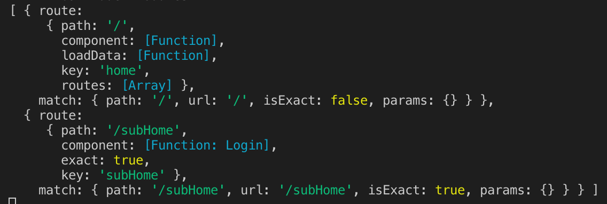

下面我们来根据用户访问的路由组件，执行它的 loadData 方法，加载数据。

### 服务器端获取异步数据，渲染后返回给浏览器

遍历 matchedRoutes 数组，可以看到里面各个路径对应的路由信息，假如 matchedRoutes 数组的其中的数据项里有 loadData 方法，说明是需要预加载数据的组件。所以执行它的 loadData 方法，把数据异步加载返回，塞到 promises 数组里。等到所有的异步数据都加载好后，再 res.send 返回 render 函数中渲染的所有内容给浏览器。

```jsx {22,23,24,25}
// src/server/index.js
import express from "express";
import { matchRoutes } from "react-router-config";
import { render } from "./utils";
import getStore from "../store";
import routes from "../Routes";

const app = express();
app.use(express.static("public"));

app.get("*", function(req, res) {
  // 服务器端：在这里拿到异步的数据并填充到store，就可以在服务器端渲染时有数据一块渲染
  const store = getStore();

  // 根据路由的路径，来往store里面加数据
  const matchedRoutes = matchRoutes(routes, req.path);

  // 用于管理多个promise 请求的执行结果
  const promises = [];

  matchedRoutes.forEach(item => {
    // 让matchRoutes里面所有的组件，对应的loadData方法执行一次
    if (item.route.loadData) {
      // item.route.loadData() 用于获取异步数据
      promises.push(item.route.loadData(store));
    }
  });
  // 所有异步数据都获取到后，再服务端渲染页面
  Promise.all(promises).then(() => {
    res.send(render(store, routes, req));
  });
});
var server = app.listen(3000);
```

```jsx
// src/server/utils.js
import React from "react";
import { renderToString } from "react-dom/server";
import { StaticRouter, Route } from "react-router-dom";
import { Provider } from "react-redux";

export const render = (store, routes, req) => {
  const content = renderToString(
    <Provider store={store}>
      <StaticRouter location={req.path} context={{}}>
        <div>
          {routes.map(route => (
            <Route {...route} />
          ))}
        </div>
      </StaticRouter>
    </Provider>
  );
  return `
	<html>
		<head>
			<title>ssr</title>
		</head>
		<body>
			<div id="root">${content}</div>
			<script src='/index.js'></script>
		</body>
	</html>
	`;
};
```

执行组件对应的 loadData 方法，把数据异步加载返回。这里涉及到比较深入的 Promise 执行过程。可以看代码进行理解。例如下面的

```jsx {4,5,6,7,8,9,10}
// src/containers/Home/store/actions.js
export const getHomeList = () => {
  return dispatch => {
    // return 一个Promise 对象，一级级往上传
    return axios
      .get("http://47.95.113.63/ssr/api/news.json?secret=abcd")
      .then(res => {
        const list = res.data.data;
        dispatch(changeList(list));
      });
  };
};
```

```jsx {18,19,20,21,22,23}
// src/containers/Home/index.js
// ...
import { connect } from "react-redux";
import { getHomeList } from "./store/actions";

class Home extends Component {
  // ...
  render() {
    // ...
  }
  componentDidMount() {
    // 这里只有在客户端渲染才执行
    // 从mapDispatchToProps里来的getHomeList()
    this.props.getHomeList();
  }
}

Home.loadData = store => {
  // 这个函数，负责在服务器端渲染之前，把这个路由需要的数据提前加载好
  // 传一个store值给它是为了使之可以dispatch
  // store.dispatch这个函数的目的是中间件处理，到actions的getHomeList()方法里具体处理它的派发内容
  return store.dispatch(getHomeList());
};

const mapStateToProps = state => ({
  // ...
});

const mapDispatchToProps = dispatch => ({
  // 这里是给客户端渲染时使用
  getHomeList() {
    dispatch(getHomeList());
  }
});

export default connect(
  mapStateToProps,
  mapDispatchToProps
)(Home);
```

(多提一句，在 Home.loadData 里，因为它是服务端渲染时去调用 store.dispatch(getHomeList)，处理的是服务端的 Store，并不在客户端处理。所以在 react-redux 中的 connect 方法对应的 mapDispatchToProps 是不需要声明就能使用 getHomeList 方法的)

这时候服务端返回的数据里，就有了渲染好的数据。
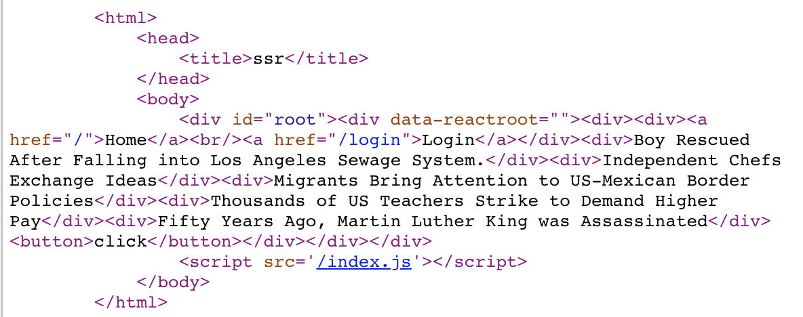

### 数据的注水和脱水

为什么要注水和脱水？

在访问首页 `/` 的时候，放慢网速我们会发现先白屏，然后才出现了内容。

原因是什么呢？

尽管服务端已经把首页的内容都渲染好了才返回，但是因为在客户端中，Home 组件的生命周期函数 componentDidMount 会执行一次，于是它便会重新执行方法向后台请求数据，然后重新执行了一次客户端渲染，把数据内容填充到页面上。

这造成了网络请求的浪费，损耗性能。

既然我们已经在服务端已经请求过了数据，那在客户端渲染时，就应该直接使用服务端请求好的数据，注入到客户端渲染中的 state。这个就叫做**注水**。

例如，在返回的页面内容 window.context 下，注入服务端获取到的 store 的数据内容：
```jsx {11,12,13}
// src/server/utils.js
// ...
return `
  <html>
    <head>
      <title>ssr</title>
    </head>
    <body>
      <div id="root">${content}</div>
      <script>
        window.context = {
          state: ${JSON.stringify(store.getState())}
        }
      </script>
      <script src='/index.js'></script>
    </body>
  </html>
`;
```

服务端返回的页面里可见 window.context 下的内容。
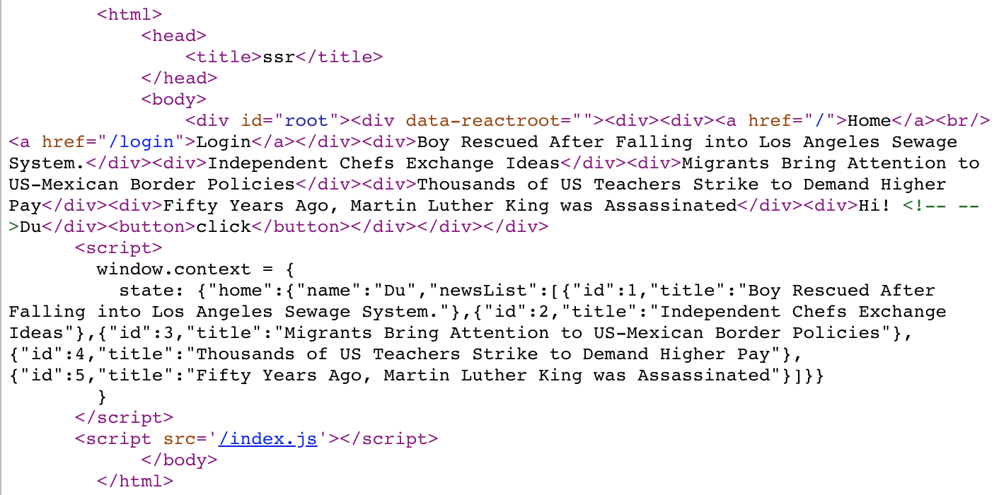

在客户端拿到服务端给的数据直接使用，而不重新去请求数据，这个使用服务端给的数据的过程就是**脱水**。

```jsx {16}
// src/store/index.js
import { createStore, applyMiddleware, combineReducers } from "redux";
import thunk from "redux-thunk";
import { reducer as homeReducer } from "../containers/Home/store";

const reducer = combineReducers({
  home: homeReducer
});

// 服务端渲染时创建 store 的方法
export const getStore = () => {
  return createStore(reducer, applyMiddleware(thunk));
};
// 客户端渲染时创建 store 的方法
export const getClientStore = () => {
  const defaultState = window.context.state;
  // createStore的第二个参数是默认的初始值
  return createStore(reducer, defaultState, applyMiddleware(thunk));
};
// ...
```

然后在客户端渲染这边更变获取 store 的方法：

```jsx {6,10}
// src/client/index.js
// ...
import { Provider } from "react-redux";
import { getClientStore } from "../store";

const store = getClientStore();

const App = () => {
  return (
    <Provider store={store}>
      <BrowserRouter>
// ...
```

然后在客户端执行的是 getClientStore 方法，因为在客户端渲染的时候，window.context.state 已经是有内容的了，所以可以直接取到服务端注水时提供的数据。放到 createStore 的第二个参数传入。

这样就可以使得客户端直接使用服务端渲染好的数据。

### 优化

但是看网络请求，因为 componentDidMount 的存在，哪怕客户端渲染时直接使用服务端返回的数据，也会发送请求。所以我们要判断，假如服务端已经返回数据了，客户端就不请求数据。


最后要重申一次的是，服务端渲染只是第一次访问页面时才有用，之后的页面就完全交给了客户端渲染。所以 componentDidMount 的存在是很有必要的，它在服务端没有返回数据的时候，客户端自己有能力去请求数据。

## 使用 Node 作为数据获取中间层

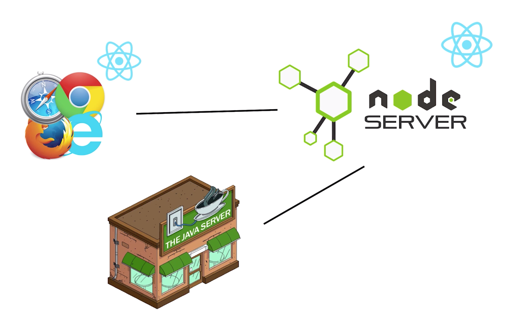
既然引入了中间层，那客户端就不能直接去和后台请求数据，必须通过 Node 层。

### 使用 proxy 代理，让中间层承担数据获取职责

之前客户端请求数据的时候直接向后台请求了，是不规范的操作，应该客户端先走 node 中间层，再由中间层做数据请求。

我们可以使用 Proxy 做代理去解决。这里用的是 express，可以借用第三方库 express-http-proxy 来做。

文档：[https://github.com/villadora/express-http-proxy](https://github.com/villadora/express-http-proxy)

例如我们想请求的完整地址是 http://47.95.113.63/ssr/api/news.json?secret=M5s2sPneDE

代理地址，把本地 localhost 请求代理到 http://47.95.113.63/

```jsx
// src/server/index.js
// ...
// 代理：当请求地址为 /api 时，执行代理
app.use(
  "/api",
  proxy("http://47.95.113.63", {
    proxyReqPathResolver: function(req) {
      // req.url : /news.json?secret=M5s2sPneDE
      return "/ssr/api" + req.url;
    }
  })
);
// ...
```

再更改 axios 的请求地址。

```jsx
// src/containers/Home/store/actions.js
// ...
export const getHomeList = () => {
  return dispatch => {
    return (
      axios
        // get("http://47.95.113.63/ssr/api/news.json?secret=abcd")
        .get("/api/news.json?secret=abcd")
        .then(res => {
          const list = res.data.data;
          dispatch(changeList(list));
        })
    );
  };
};
```

代理成功。


因为同构的因故，getHomeList 这个获取数据的方法客户端和服务端都会各自执行一次，但是这只能在客户端渲染时请求成功，**服务器渲染时，并没有代理到 http://47.95.113.63 这后台地址上，直接访问服务器的根目录是请求不到数据的。**

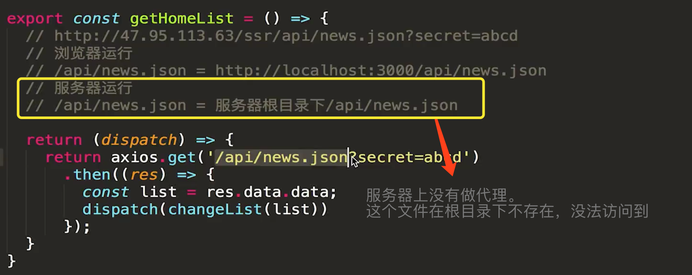

所以我们需要区分服务器端请求和客户端请求来做代理，服务器端请求不需要代理，而是直接访问后台获取数据。然后再使用 axios 中的 instance 来合理化判断代码。

文档：[https://github.com/axios/axios#creating-an-instance](https://github.com/axios/axios#creating-an-instance)

```jsx {5,6}
// src/client/request.js
import axios from "axios";

const instance = axios.create({
  // 客户端请求数据，直接 /
  baseURL: "/"
});

export default instance;
```

```jsx {5,6}
// src/server/request.js
import axios from "axios";

const instance = axios.create({
  // 服务端请求数据，直接请求后台地址
  baseURL: "http://47.95.113.63/ssr"
});

export default instance;
```

用 axios 创建一个新的 instance 对象并导出，后续分别调用。

调用获取数据方法时，传一个 boolean 值做标记，以区分是服务端还是客户端在调用这个方法。

```jsx {10,11,17,18}
// src/containers/Home/index.js
// ...
class Home extends Component {
  // ...
  render() {
    // ...
  }
  componentDidMount() {
    if (!this.props.list.length) {
      // 客户端请求数据
      this.props.getHomeList(false);
    }
  }
}

Home.loadData = store => {
  // 服务端请求数据
  return store.dispatch(getHomeList(true));
};
// ...
```

```jsx {12,13,16}
// src/containers/Home/store/actions.js
import { CHANGE_LIST } from "./constants";
import clientAxios from "../../../client/request";
import serverAxios from "../../../server/request";

const changeList = list => ({
  type: CHANGE_LIST,
  list
});

export const getHomeList = server => {
  // 根据传入的值来判断是服务端渲染还是客户端渲染
  const request = server ? serverAxios : clientAxios;
  return dispatch => {
    // 用instance 替换原来的axios对象去发送请求
    return request.get("/api/news.json?secret=abcd").then(res => {
      const list = res.data.data;
      dispatch(changeList(list));
    });
  };
};
```

是服务端调用则使用它对应的 instance 来发请求，

是客户端调用则使用它对应的 instance 来发请求。

这样就可以解决服务端调用并不需要做代理的问题。

### redux-thunk 中的 withExtraArgument

上面的请求方式有个问题，就是每次调用方法的时候都需要去声明是不是来自 server 的请求，比较繁琐，我们可以从源头去管理区分，这就需要用到 redux-thunk 中的 withExtraArgument 方法。

> Redux Thunk supports injecting a custom argument using the `withExtraArgument` function.（注入一个自定义的对象，然后可以在thunk调用的第三个参数处取出。）

文档：[https://github.com/reduxjs/redux-thunk#injecting-a-custom-argument](https://github.com/reduxjs/redux-thunk#injecting-a-custom-argument)


server/src/store/index.js
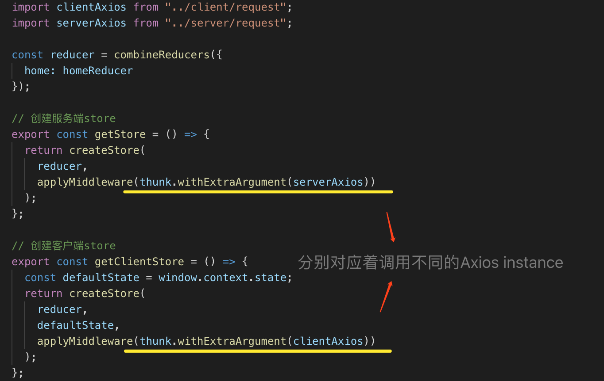
按着官方示例改造 thunk 的引用。

```jsx {4,5}
// src/containers/Home/store/actions.js
// ...
export const getHomeList = () => {
  // redux-thunk的第2，3个参数用法出现
  return (dispatch, getState, axiosInstance) => {
    return axiosInstance.get("/api/news.json?secret=abcd").then(res => {
      const list = res.data.data;
      dispatch(changeList(list));
    });
  };
};
```

因为 redux-thunk 的作用，执行 getHomeList 方法的第三个参数就是我们传入的 clientAxios/serverAxios 的 instance。

### renderRoutes 方法实现对多级路由的支持

之前的方式，只能渲染一级路由。

```jsx {6,7,8,9}
export const render = (store, routes, req) => {
  const content = renderToString((
    <Provider store={store}>
      <StaticRouter location={req.path} context={{}}>
        <div>
          {/*只能渲染一级路由(只有一层 Route)*/}
          {routes.map(route => (
            <Route {...route}/>
          ))}
        </div>
      </StaticRouter>
    </Provider>
  ));
```

我们改成多级路由后，需要配合 react-router-config 的 renderRoutes 方法来渲染多级路由。

文档：[https://github.com/ReactTraining/react-router/tree/master/packages/react-router-config#renderroutesroutes-extraprops---switchprops--](https://github.com/ReactTraining/react-router/tree/master/packages/react-router-config#renderroutesroutes-extraprops---switchprops--)

路由文件：
server/src/Routes.js
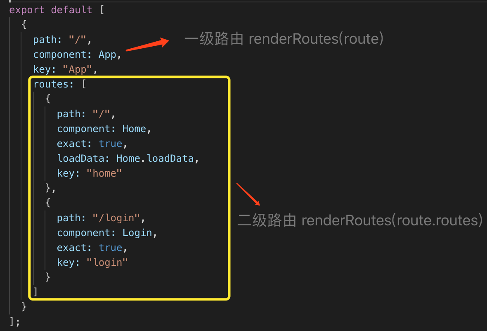

```jsx {10,11}
// src/server/utils.js
// ...
import { StaticRouter } from "react-router-dom";
import { renderRoutes } from "react-router-config";

export const render = (store, routes, req) => {
  const content = renderToString(
    <Provider store={store}>
      <StaticRouter location={req.path} context={{}}>
        {/*这里渲染一级路由那一层的东西*/}
        {renderRoutes(routes)}
      </StaticRouter>
    </Provider>
  );
// ...
```

```jsx {13,14}
// src/client/index.js
// ...
import { BrowserRouter } from "react-router-dom";
import { renderRoutes } from "react-router-config";
import routes from "../Routes";

const store = getClientStore();

const App = () => {
  return (
    <Provider store={store}>
      <BrowserRouter>
        {/*这里之渲染一级路由，不需要把二级路由的信息传给renderRoutes*/}
        {renderRoutes(routes)}
      </BrowserRouter>
    </Provider>
  );
};
// ...
```

服务端和客户端的一级路由只需要 renderRoutes 最外层路由信息就可以。

App 组件是一级路由显示的组件，props 会接受到传过来的路由信息对象，在这里去渲染二级路由。

```jsx {10,11}
// src/App.js
import React from "react";
import Header from "./components/Header";
import { renderRoutes } from "react-router-config";

const App = props => {
  return (
    <div>
      <Header />
      {/*渲染二级路由*/}
      {renderRoutes(props.route.routes)}
    </div>
  );
};

export default App;
```

**一级路由对应的就是 App 组件，所以需要在这个组件里去渲染二级路由。这时候就需要 renderRoutes 第二层路由信息。**

（在其他组件共用的 Header，可以放在这里，只要访问了 / 根路径，Header 组件总会出现。）

打印输出 props.route.routes，其实就是二级路由的对象信息。
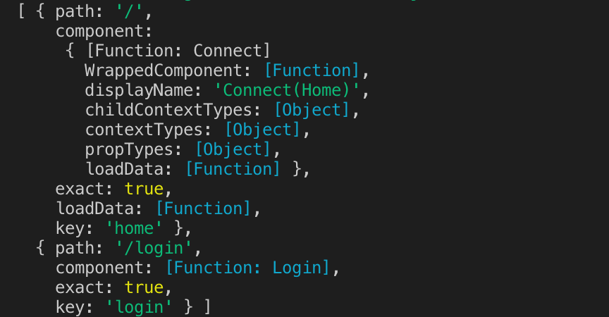

配合使用 renderRoutes 方法就这样既可实现多级路由渲染。

### 登陆功能

根据 login 的值显示不同的内容：

```jsx {9,10,11,12,14}
// src/components/Header/index.js
// ...
return (
  <div>
    <Link to="/">首页</Link>
    <br />
    {/*根据login的值显示不同的内容*/}
    {login ? (
      <Fragment>
        <Link to="/login">翻译列表</Link>
        <button onClick={handleLogout}>退出</button>
      </Fragment>
    ) : (
      <button onClick={handleLogin}>登陆</button>
    )}
  </div>
);
// ...
```

在服务端渲染前，获取 login 的值，以便渲染 Header 的内容。

```jsx
// src/App.js
// ...
App.loadData = store => {
  return store.dispatch(actions.getHeaderInfo());
};
// ...
```

```jsx {13,22,31}
// src/components/Header/store/actions.js
import { CHANGE_LOGIN } from "./constants";

const changeLogin = value => ({
  type: CHANGE_LOGIN,
  value
});

export const login = () => {
  return (dispatch, getState, axiosInstance) => {
    return axiosInstance.get("/api/login.json?secret=abcd").then(res => {
      // 登录成功
      dispatch(changeLogin(true));
    });
  };
};

export const logout = () => {
  return (dispatch, getState, axiosInstance) => {
    return axiosInstance.get("/api/logout.json?secret=abcd").then(res => {
      // 退出登录
      dispatch(changeLogin(false));
    });
  };
};

export const getHeaderInfo = () => {
  return (dispatch, getState, axiosInstance) => {
    return axiosInstance.get("/api/isLogin.json?secret=abcd").then(res => {
      // 获取登录状态(true / false)
      dispatch(changeLogin(res.data.data.login));
    });
  };
};
```

再由 reducer 去改变 store 里 login 的值。

```jsx {11,12,13,14}
// src/components/Header/store/reducer.js
import { CHANGE_LOGIN } from "./constants";

const defaultState = {
  login: true
};

export default (state = defaultState, action) => {
  switch (action.type) {
    case CHANGE_LOGIN:
      return {
        ...state,
        login: action.value
      };
    default:
      return state;
  }
};
```


### cookies 携带问题

流程：

1. 刚进入页面的时候，处于非登录状态。
2. 用户点击登录按钮，打接口进行登录操作。
3. 浏览器发请求给中间层，也就是 Node 服务器
4. Node 服务器转发请求给后台 api 服务器，进行登录
5. 后台 api 服务器生成 cookies，返回时写入浏览器
6. 浏览器里有 cookies，登录成功
7. 但用户重新刷新浏览器的时候
8. 浏览器发 HTTP 请求 html（请求是携带着 cookies 的）
9. Node 服务器进行服务器渲染
10. 进行服务器渲染前，首先要去后台 api 服务器请求数据，但是这时候的请求是不携带 cookies 的（node 端不是浏览器），所以造成了重新刷新页面登录状态不对的 bug

下面来解决这个问题。

其实只需要在 Node 服务器转发请求的时候，带上客户端之前的 cookies 去请求，问题就解决了。
发请求的 axios 方法，可以加带一个 headers 对象，往里加 cookie 参数。

为了接收一个 req 参数，原来 createInstance 是个对象，将其改造成函数形式。

```jsx {7,8,9}
// src/server/request.js
import axios from "axios";

const createInstance = req =>
  axios.create({
    baseURL: "http://47.95.113.63/ssr",
    headers: {
      cookie: req.get("cookie") || ""
    }
  });

export default createInstance;
```

对于 req 参数，由 express 捕获并传递给 getStore()方法。

```jsx {4}
// src/server/index.js
// ...
app.get('*', function (req, res) {
	const store = getStore(req);
// ...
```

在创建服务端的 store 时把 req 传过去，这样请求的 headers 中就带有 cookie 信息了。

```jsx {7,16}
// src/store/index.js
import { createStore, applyMiddleware, combineReducers } from "redux";
import thunk from "redux-thunk";
import { reducer as homeReducer } from "../containers/Home/store";
import { reducer as headerReducer } from "../components/Header/store";
import clientAxios from "../client/request";
import serverAxios from "../server/request";
const reducer = combineReducers({
  home: homeReducer,
  header: headerReducer
});
// 创建服务端 store
export const getStore = req => {
  return createStore(
    reducer,
    applyMiddleware(thunk.withExtraArgument(serverAxios(req)))
  );
};

export const getClientStore = () => {
  const defaultState = window.context.state;
  return createStore(
    reducer,
    defaultState,
    applyMiddleware(thunk.withExtraArgument(clientAxios))
  );
};
```

### 曾经的问题：令你深刻的 Bug ?

服务端渲染前的 App 组件要执行的 loadData 方法：

```jsx
App.loadData = store => {
  store.dispatch(actions.getHeaderInfo());
};
```

App 组件返回的数据其实是 promise，而这时却没有 return 回去。
在服务端渲染的时候，要等到所有的 promise 都获取数据返回成功，才去执行渲染页面的内容。

```jsx
// 用于管理多个promise请求的执行结果
const promises = [];
matchedRoutes.forEach(item => {
  if (item.route.loadData) {
    // item.route.loadData() 用于获取异步数据
    // 返回数组里的是Promise对象
    promises.push(item.route.loadData(store));
  }
});
Promise.all(promises).then(() => {
  res.send(render(req, store, routes));
});
```

所以 loadData 应该要 return 回去，promises 数组那边才能接受到一个 Promise 对象。
这样服务端渲染前接 Promise.all 收到的对象才是 Promise，而不是 undefined。

```jsx
App.loadData = store => {
  return store.dispatch(actions.getHeaderInfo());
};
```

## 细节问题处理

### 统一管理密钥

url 上所带的统一的参数，可以放到 axios 的 Instance 里统一调用。
服务端和客户端都要这样用的时候，可以引入一个公共的 config 文件再去引用。

```jsx
// src/server/request.js
import axios from "axios";
// config 里写着各类信息
import config from "../config";

const createInstance = req =>
  axios.create({
    baseURL: "http://47.95.113.63/ssr",
    headers: {
      cookie: req.get("cookie") || ""
    },
    params: {
      secret: config.secret
    }
  });

export default createInstance;
```

### 404 页面

配置路由，新增一个没有路径时对应的组件：

```js
{
  component: NotFound,
}
```

server/src/Routes.js
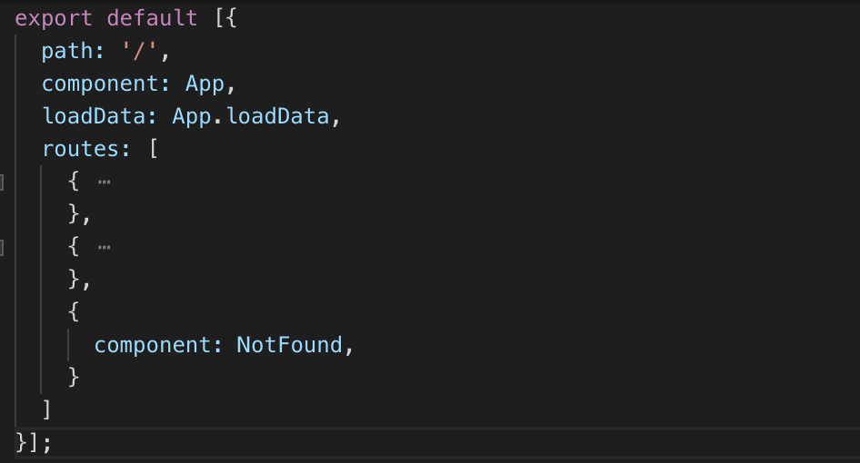

服务端渲染的 StaticRouter 组件中，contenxt 对象会传给它的所有子组件，子组件可以通过 props.staticContext 获取到这个对象的值。

```jsx {3,7}
// src/server/utils.js
// ...
export const render = (store, routes, req, context) => {
  const content = renderToString(
    <Provider store={store}>
      {/*StaticRouter的context对象会传给它的所有子组件*/}
      <StaticRouter location={req.path} context={context}>
        <div>{renderRoutes(routes)}</div>
      </StaticRouter>
    </Provider>
  );
// ...
```

那我们如何能知道当前页是 404 页面？

可以在 404 页面对应的组件 NotFound 里去改变 staticContext 的值，只有在 404 页面中，才会使 staticContext.NOT_FOUND 的值为 true。

componentWillMount 服务器端也会运行，所以我们将改变 staticContext 的操作放到这里。

```jsx {5,6}
// src/containers/NotFound/index.js
class NotFound extends Component {
  // componentWillMount 服务器端也会运行
  componentWillMount() {
    const { staticContext } = this.props;
    staticContext && (staticContext.NOT_FOUND = true);
  }

  render() {
    return <div>404, sorry, page not found</div>;
  }
}
```

因为在客户端渲染上，没有 StaticRouter 这个组件，所以也没有 staticContext 这个值，所以我们要在确保有 staticContext 的前提下，才去往 staticContext 里添加一个 NOT_FOUND 对象并设为 true。

最后，要设置 404 页面返回的 status 码为 404。

这个值默认为 200。

```jsx {19,20,21,22}
// src/server/index.js
// ...
app.get("*", function(req, res) {
  const store = getStore(req);
  // 根据路由的路径，来往store里面加数据
  const matchedRoutes = matchRoutes(routes, req.path);
  // 让matchRoutes里面所有的组件，对应的loadData方法执行一次
  const promises = [];
  matchedRoutes.forEach(item => {
    if (item.route.loadData) {
      promises.push(item.route.loadData(store));
    }
  });
  // 所有一部数据都获取到后，再服务端渲染页面
  Promise.all(promises).then(() => {
    const context = {};
    const html = render(store, routes, req, context);

    if (context.NOT_FOUND) {
      // 设置网络请求的status码为404
      res.status(404);
      res.send(html);
    } else {
      res.send(html);
    }
  });
});
```

这里要留意到一点：

为什么要把 render() 赋给一个变量 html？

这是为了做判断，res.send 返回前，render 函数已执行好，即页面已渲染好，再根据条件返回给客户端。

### 实现服务器端 301 重定向

因为 `<Redirect />` 仅限于客户端重定向，当没有未登陆状态时去访问其他页面（应当没有权限访问的），服务端会返回页面内容，然后客户端再进行重定向跳转到其他页面，这是不太合理的。
所以我们要做到服务端重定向。

在重定向时，react-router-config 都会帮我做一件事：往 context 里填充这样的内容。


文档：[https://github.com/ReactTraining/react-router/tree/master/packages/react-router-config](https://github.com/ReactTraining/react-router/tree/master/packages/react-router-config)

```jsx {3,7}
// src/server/utils.js
// ...
export const render = (store, routes, req, context) => {
  const content = renderToString(
    <Provider store={store}>
      {/*StaticRouter的context对象会传给它的所有子组件*/}
      <StaticRouter location={req.path} context={context}>
        <div>{renderRoutes(routes)}</div>
      </StaticRouter>
    </Provider>
  );
// ...
```

```jsx {19,20}
// src/server/index.js
// ...
app.get("*", function(req, res) {
  const store = getStore(req);
  // 根据路由的路径，来往store里面加数据
  const matchedRoutes = matchRoutes(routes, req.path);
  // 让matchRoutes里面所有的组件，对应的loadData方法执行一次
  const promises = [];
  matchedRoutes.forEach(item => {
    if (item.route.loadData) {
      promises.push(item.route.loadData(store));
    }
  });
  Promise.all(promises).then(() => {
    const context = {};
    const html = render(store, routes, req, context);
    // res.send 返回前，页面已经渲染好。
    // 重定向时，react-router-config 会给 context.action 注入这个值
    if (context.action === "REPLACE") {
      res.redirect(301, context.url);
    } else if (context.NOT_FOUND) {
      res.status(404);
      res.send(html);
    } else {
      res.send(html);
    }
  });
});
```

这样就可以设置 status 码为 301，并跳转到 context.url 里的重定向页面。

### 容错处理数据请求失败情况下 promise 的处理

目前对服务端渲染的方法是这样的：

```jsx
// ...
const promises = [];
matchedRoutes.forEach(item => {
  if (item.route.loadData) {
    promises.push(item.route.loadData(store));
  }
});
Promise.all(promises).then(() => {
  const context = {};
  const html = render(store, routes, req, context);

  if (context.action === "REPLACE") {
    res.redirect(301, context.url);
  } else if (context.NOT_FOUND) {
    res.status(404);
    res.send(html);
  } else {
    res.send(html);
  }
});
// ...
```

这种情况下，只要其中的一个组件 loadData 返回的 Promise 对象是失败的，那全部的组件都不会被渲染，所以需要我们做容错处理，使得就算其中一个组件获取数据失败，其他成功获取数据的组件依旧可以显示。

**我们的原则是，如果某个组件能正常加载，就应该把它显示出来，而不要受到其他组件失败的影响。**

假设一个页面要加载 A,B,C,D 四个组件，这四个组件都需要服务器端加载数据。

而 A 组件加载数据错误，对于剩下的组件可能有以下两种情况：

1. B, C, D 组件数据已经加载完成了。

2. B, C, D 接口比较慢，B, C, D 组件数据没有加载完成。

第一种情况，给 Promise.all 加上 catch，**Promise.all().then().catch()**，在 catch 中执行和 then 一样的操作。这样 Promise.all() 就算失败，也会执行 catch 里的内容，渲染出 B,C,D 组件的内容。

但是第二种情况，因为接口速度慢，当 B,C,D 还没有返回内容时，因为 A 组件加载失败了，**Promise.all()** 则会直接去执行 **catch()** 中的内容，那就算执行了渲染方法，页面也什么都没有，因为 B,C,D 还没有返回数据。

所以我们去掉 Promise.all 上的 catch 方法，在 loadData 返回的对象的基础上，再封装一个 Promise 对象，无论组件成功还是失败都返回 resolve，这样 promises 数组中的所有 Promise 对象都是 resolve 状态的。

这样确保了每一个有 loadData 方法的对象都有执行 loadData 方法，就算接口或是网速慢也会等待返回结果，得到了结果后才返回的 resolve，也因为所有 loadData 返回的 Promise 对象都是 resolve，所以 Promise.all 走的是 then() 方法。

```jsx {4,5,6,7,8,9,10}
// src/server/index.js
matchedRoutes.forEach(item => {
  if (item.route.loadData) {
    const promise = new Promise((resolve, reject) => {
      // 成功或失败都返回resolve，所以Promise.all肯定会走then()，把能渲染的全渲染出来
      item.route
        .loadData(store)
        .then(resolve)
        .catch(resolve);
    });
    promises.push(promise);
  }
});

// promises = [ a, b, c, d ]
Promise.all(promises).then(() => {
  const context = {};
  const html = render(store, routes, req, context);
  if (context.action === "REPLACE") {
    res.redirect(301, context.url);
  } else if (context.NOT_FOUND) {
    res.status(404);
    res.send(html);
  } else {
    res.send(html);
  }
});
// ...
```

### 一个 loadData 的潜在问题

例如 Home 组件在导出的时候：

```jsx
export default connect(
  mapStateToProps,
  mapDispatchToProps
)(Home);
```

这里导出的其实已经不是 Home 组件了，而是经过了 connect 方法封装后的 Home 组件（高阶组件），而我们却在 Home 下直接绑定了 loadData 方法。

```jsx
Home.loadData = store => {
  return store.dispatch(getHomeList());
};
```

在 react-router-config 调用 loadData 方法的时候，这就可能是有问题的，因为调用的是原来 Home 下的 loadData 方法，而我们 export 出去的却是一个 connect()(Home) 组件。

之所以没有出错是因为 react-redux 将 Home 下的所有方法原封不动的传给了新的 connect()(Home) 组件。但是我们同样可以在这里做一些更改，导出的是一个 ExportHome 高阶组件。

```jsx
const ExportHome = connect(
  mapStateToProps,
  mapStateToDispatch
)(Home);

export default ExportHome;
```

而 loadData 绑定在 ExportHome 上，这样确保了导出的组件上是一定有 loadData 方法的。

```jsx
ExportHome.loadData = store => {
  return store.dispatch(getHomeList());
};
```

## 处理 SSR 框架中的 CSS 样式

### 实现 CSS 样式的服务器端渲染

之前用 webpack 的 isomorphic 只是做到了在服务端打包 CSS，但是并没有把 CSS 放在渲染内容里一块返回给浏览器，从而会导致在客户端重新渲染的时候，出现样式抖动。(因为服务端渲染返回是数据是没有样式内容的，一旦禁用了 JS，样式为空，所以需要把 CSS 样式在服务端渲染时也塞到页面中，一块返回给浏览器)


做到这个很简单，在服务端渲染的时候，我们有 staticContext 和子组件们做通信，利用 staticContext 把 CSS 的内容给获取到，再渲染到要返回的 HTML 上就可以。

this.props.staticContext 只有服务端渲染时才有，`_getCss` 方法是服务端渲染时 isomorphic-style-loader 提供的方法，它可以获取到 CSS 的内容。再把 css 的内容给 staticContext 下新建一个 css 对象。

```jsx {6,7,8}
// src/containers/Home/index.js
import styles from "./style.css";

class Home extends Component {
  componentWillMount() {
    if (this.props.staticContext) {
      this.props.staticContext.css.push(styles._getCss());
    }
  }
  // ...
```

```jsx {6,13,22}
// src/server/utils.js
// ...
export const render = (store, routes, req, context) => {
  const content = renderToString(
    <Provider store={store}>
      <StaticRouter location={req.path} context={context}>
        <div>{renderRoutes(routes)}</div>
      </StaticRouter>
    </Provider>
  );

  // css 的内容填充到变量cssStr
  const cssStr = context.css ? context.css : "";

  return `
    <html>
    <head>
      <title>ssr</title>
      <style>${cssStr}</style>
    </head>
    <body>
      <div id="root">${content}</div>
      <script>
        window.context = {
          state: ${JSON.stringify(store.getState())}
        }
      </script>
      <script src='/index.js'></script>
    </body>
    </html>
    `;
};
```

```jsx {4,5,12}
// src/server/index.js
// ...
Promise.all(promises).then(() => {
  const context = {};
  const html = render(store, routes, req, context);
  if (context.action === "REPLACE") {
    res.redirect(301, context.url);
  } else if (context.NOT_FOUND) {
    res.status(404);
    res.send(html);
  } else {
    res.send(html);
  }
});
// ...
```

这样服务端渲染出的内容就带有 CSS 样式了，解决了客户端重新渲染时会产生的页面抖动问题。
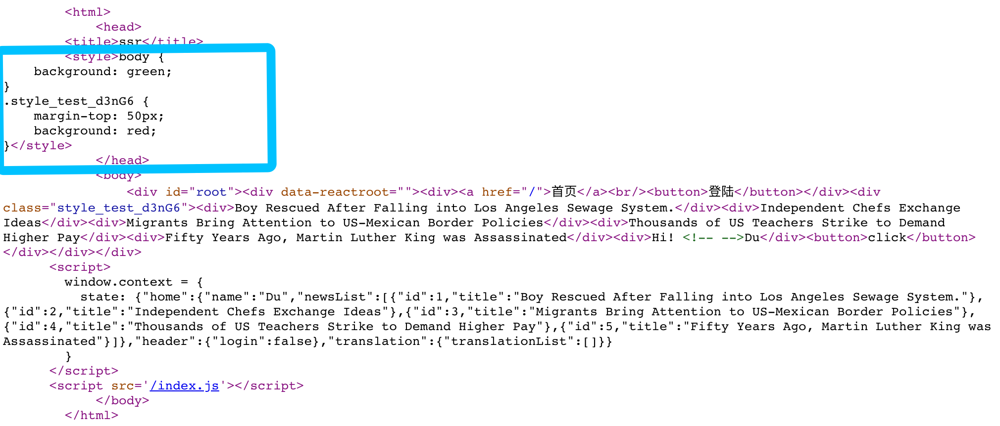

### 多组件中的样式如何整合

上面服务端渲染是往 staticContext.css 对象里塞样式数据，当多个组件同时写样式时，就会前面的会覆盖后面的样式内容。解决这个则把 staticContext.css 改写成一个数组即可。

```jsx {4}
// src/server/index.js
// ...
Promise.all(promises).then(() => {
  const context = { css: [] };
  const html = render(store, routes, req, context);

  if (context.action === "REPLACE") {
    res.redirect(301, context.url);
  } else if (context.NOT_FOUND) {
    res.status(404);
    res.send(html);
  } else {
    res.send(html);
  }
});
// ...
```

server/src/components/Header/index.js，例如 Header 组件新增 css 内容：

```jsx
// ...
import styles from "./style.css";

class Header extends Component {
  componentWillMount() {
    if (this.props.staticContext) {
      this.props.staticContext.css.push(styles._getCss());
    }
  }
// ...
```

server/src/App.js，Header 组件上没有 staticContext，所以从它的父组件 App 传过去。

```jsx {5}
// ...
const App = props => {
  return (
    <div>
      <Header staticContext={props.staticContext} />
      {renderRoutes(props.route.routes)}
    </div>
  );
};
// ...
```

server/src/server/utils.js，处理 context.css 数组用于正常显示。

```jsx {2}
// ...
const cssStr = context.css.length ? context.css.join("\n") : "";
return `
  <html>
  <head>
    <title>ssr</title>
    <style>${cssStr}</style>
  </head>
  // ...
  `;
```

可以输出 context.css 和 cssStr 做对比


### 高阶组件封装来精简代码

上面的问题在于要写很多遍重复代码，每一个组件都要写样式，都要在组件文件里把样式内容注入到 staticContext 中。那我们可以使用高阶组件来给它封装一层来简化代码。

在根目录下创建一个 withStyle.css 文件，返回一个封装后的高阶组件，第一个参数是要封装的组件，第二个参数是样式的内容：
server/src/withStyle.js

```jsx
import React, { Component } from "react";

// 这个函数，是生成高阶组件的函数
// 这个函数，返回一个组件
export default (DecoratedComponent, styles) => {
  // 返回的这个组件，叫做高阶组件
  return class NewComponent extends Component {
    componentWillMount() {
      if (this.props.staticContext) {
        this.props.staticContext.css.push(styles._getCss());
      }
    }
    render() {
      // 将原组件上所有的props传给新的组件DecoratedComponent
      return <DecoratedComponent {...this.props} />;
    }
  };
};
```

这样的话，就可以在组件里使用高阶组件去简化代码：
server/src/containers/Home/index.js

```jsx
import withStyle from "../../withStyle";

// ...

const ExportHome = connect(
  mapStateToProps,
  mapStateToDispatch
)(withStyle(Home));
```

## SEO

[react-helmet](https://github.com/nfl/react-helmet) 来处理页面 TDK。

## 使用预渲染解决 SEO 问题的新思路

针对纯客户端渲染的页面，可以使用预渲染技术来优化 SEO。

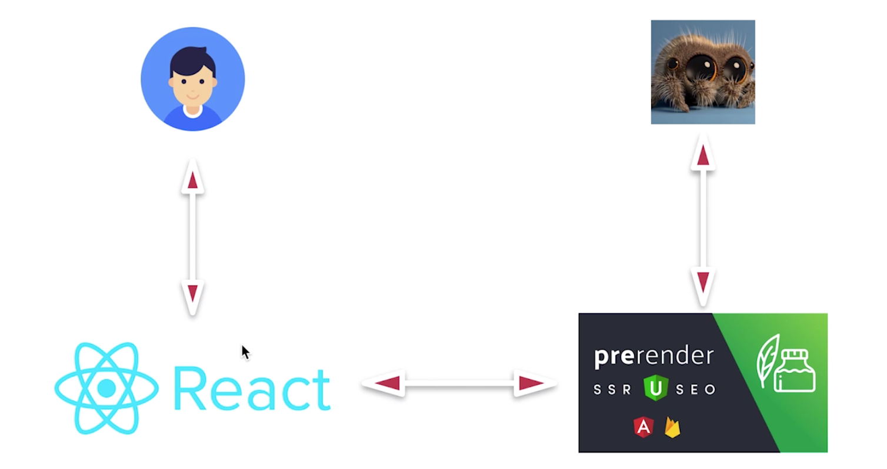

prerender
[https://github.com/prerender/prerender](https://github.com/prerender/prerender)

用 Nginx 处理，是爬虫访问页面，就把客户端渲染后完整的页面返回给爬虫。

是正常用户则正常返回页面。

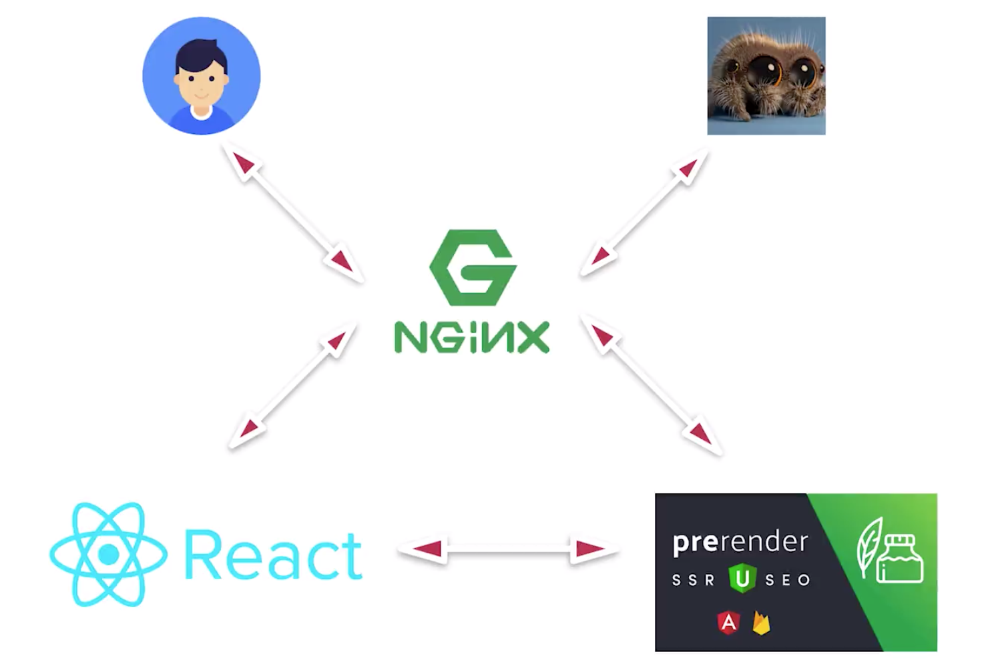

[https://prerender.io/](https://prerender.io/)
