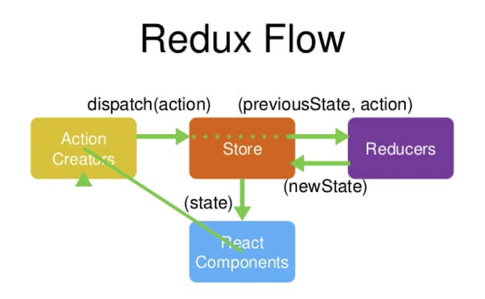
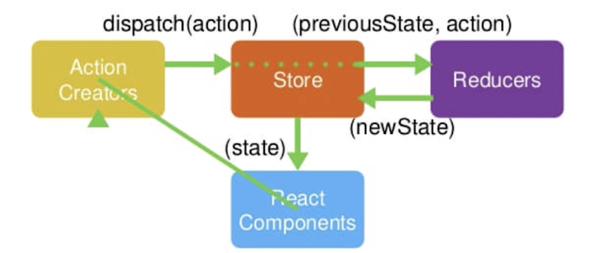

# Redux 基础部分


Redux 是 Flux 框架的改良，新引入了 Reducer 这个概念。

## Redux 工作流程


举个例子：

Store 是图书管理员

Reducers 是记录本（记录着所有图书信息和所有图书的借阅记录）

Action 是行为（借书，还书，改变内容）

Components 读者

## 创建 Store

```jsx
// store/reducer.js
const defaultState = {
  inputValue: "123",
  list: [1, 2]
};
// 返回一个函数，state指的是整个存储仓里的信息。例如整个图书馆的信息
export default (state = defaultState, action) => {
  return state;
};
```

```jsx
// store/index.js
import { createStore } from "redux";
import reducer from "./reducer";

// 把 reducer 传给 store，就例如把记录本给管理员使其方便进行操作。
const store = createStore(reducer);

export default store;
```

this.state = store.getState();
就可以把 store 里的值放到 this.state 里去，并在下方使用：

```jsx {4,11,14}
class TodoList extends Component {
  constructor(props) {
    super(props);
    this.state = store.getState();
  }

  render() {
    return (
      <div>
        <Input value={this.state.inputValue} />
        <List dataSource={this.state.list} />
      </div>
    );
  }
}
```

## Redux DevTool 基本使用

官网用法：[https://github.com/zalmoxisus/redux-devtools-extension#usage](https://github.com/zalmoxisus/redux-devtools-extension#usage)


在 createStore 函数中把以上参数带过去工具才能正常运行。

```jsx
const store = createStore(
  reducer,
  window.__REDUX_DEVTOOLS_EXTENSION__ && window.__REDUX_DEVTOOLS_EXTENSION__()
);
```

当 window 下有 REDUX_DEVTOOLS_EXTENSION 时，执行 window.REDUX_DEVTOOLS_EXTENSION()。

## Action 和 Reducer 的编写

声明一个 action 语句，然后通过 store.dispatch() 传递给 store。

**在 React 中，store 接收到 action 后会自动的把 action 转发给 reducer，让 reducer 来处理并返回值给 store。**

```jsx {6}
handleInputChange(e) {
  const action = {
    type: "change_input_value",
    value: e.target.value
  };
  store.dispatch(action);
}
```

Reducer 的处理：
```jsx {10,11,12}
// store/reducer.js
const defaultState = {
  inputValue: "123",
  list: [1, 2]
};

// reducer 可以接受state，但是绝不能修改state
export default (state = defaultState, action) => {
  if (action.type === "change_input_value") {
    const newState = JSON.parse(JSON.stringify(state));
    newState.inputValue = action.value;
    return newState;
  }
  return state;
};
```
reducer 不能直接去更新 state 的值，所以深拷贝了一个副本进行修改，再返回新的 state 给 store。

store 接收到新的 state 之后，应该去更新 components 视图，components 使用 store.subscribe(F) 订阅 store 状态，store 一更新 components 就会自动执行方法 F。
```jsx {10}
import store from "./store";

class TodoList extends Component {
  constructor(props) {
    super(props);
    this.state = store.getState();
    this.handleInputChange = this.handleInputChange.bind(this);
    this.handleStoreChange = this.handleStoreChange.bind(this);
    this.handleBtnClick = this.handleBtnClick.bind(this);
    store.subscribe(this.handleStoreChange);
  }
	// ...
}
```

方法更新，components 设置新的 state 值为 store 里的值，再重新执行 render 函数更新视图。
```jsx {2}
handleStoreChange() {
	this.setState(store.getState());
}
```

再看一遍流程图：

声明一个 action 语句，然后通过 store.dispatch() 传递给 store。

store 会自动把接收到的 action 和当前的 state 传给 reducer，reducer 处理完后，再返回新的 state 给 store，store 里的数据被更新
（注意，是 store 对自己的数据进行更新，而不是 reducer 更新的），再返回给 components ，components 订阅 store 更新随之视图更新 。



## ActionTypes 的拆分

```jsx
// store/constants.js
export const CHANGE_INPUT_VALUE = 'change_input_value';
export const ADD_TODO_ITEM = 'add_todo_item';
export const DELETE_TODO_ITEM = 'delete_todo_item';
```
**我们为什么要把字符串提取出来，放到一个常量中？**

因为常量或者是变量在代码里拼写错的时候，会报异常以便迅速定位，但是字符串拼写错就不会报异常难以排错。

## 使用 actionCreator 统一创建 action

目的：统一管理 action。

原来的写法，不利于维护，我们可以放在一个文件里统一管理。
```jsx
handleInputChange(e) {
	const action = {
		type: CHANGE_INPUT_VALUE,
		value: e.target.value
	};
	store.dispatch(action);
}
handleBtnClick() {
	const action = {
		type: ADD_TODO_ITEM
	};
	store.dispatch(action);
}
handleItemDelete(index) {
	const action = {
		type: DELETE_TODO_ITEM,
		index
	};
	store.dispatch(action);
}
```

新建一个 actionCreator.js 里统一写法，返回一个函数：
```jsx
// store/actionCreator.js
import { CHANGE_INPUT_VALUE, ADD_TODO_ITEM, DELETE_TODO_ITEM } from './constants';

export const getInputChangeAction = (value) => ({
	type: CHANGE_INPUT_VALUE,
	value
});
export const getAddItemAction = () => ({
	type: ADD_TODO_ITEM
});
export const getDeleteItemAction = (index) => ({
	type: DELETE_TODO_ITEM,
	index
});
```
然后上面的可以简化为函数调用：
```jsx
handleInputChange(e) {
	const action = getInputChangeAction(e.target.value);
	store.dispatch(action);
}
handleBtnClick() {
	const action = getAddItemAction();
	store.dispatch(action);
}
handleItemDelete(index) {
	const action = getDeleteItemAction(index);
	store.dispatch(action);
}
```

## Redux 基础小结

- Store 是唯一的。
- 只有 Store 能改变自己的内容。
- Reducer 必须是个纯函数。（纯函数是指 给定固定的输入，就一定会有固定的输出，而且不会有任何副作用。）

**基础 API**

创建一个store：`const store = createStore(reducer);`

派发一个action：`store.dispatch(action);`

获取store的值：`store.getState();`

订阅store的状态变化：`store.subscribe(Function);`