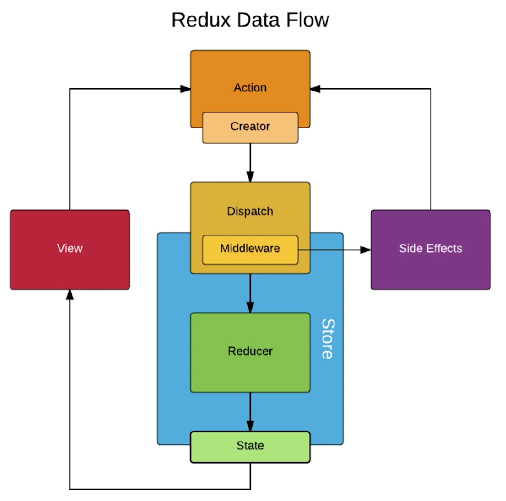
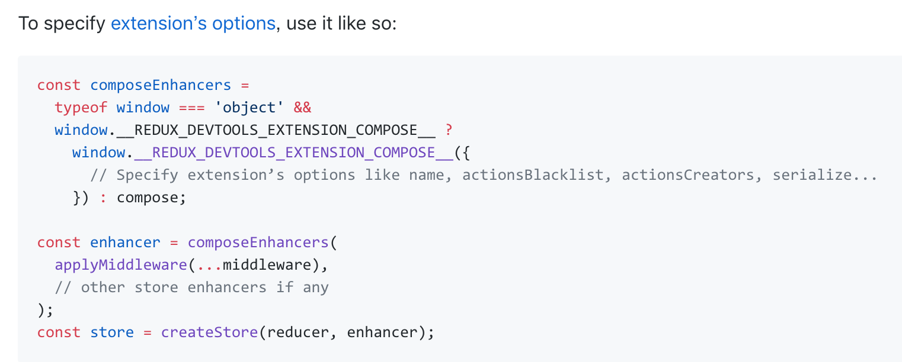

# Redux 中级部分

## UI 组件和容器组件拆分

UI 组件负责页面的渲染，容器组件负责页面逻辑。

## 无状态组件

一个组件，只有一个 render 函数，没有 state，那我们可以将其改写成 **无状态组件**。

无状态组件优点：性能好。一个无状态组件会比普通组件(class)少了生命周期等等状态。

原先的 UI 组件，可以改写成无状态组件。

```jsx
class TodoListUI extends Component {
  render() {
    return (
      <div>
        <Input
          value={this.props.inputValue}
          onChange={this.props.handleInputChange}
        />
      </div>
    );
  }
}
```

改写为无状态组件

1. 无状态组件实质就是一个函数，直接把类改成函数。
2. this.props 直接改为入参 props。

```jsx
const TodoListUI = props => {
  // 解构赋值
  const { inputValue, handleInputChange } = props;
  return (
    <div>
      <Input value={inputValue} onChange={handleInputChange} />
    </div>
  );
};
```

## Redux 中发送异步请求获取数据

```jsx
// /store/actionCreators.js
export const initListAction = data => ({
  type: INIT_LIST_ACTION,
  data
});
```

```jsx
// TodoList.js
// 这种异步操作放到组件里做是不推荐的，应该放到action里去统一管理
componentDidMount() {
	axios.get("/list.json").then(res => {
		const data = res.data;
		const action = initListAction(data);
		store.dispatch(action);
	});
}
```

```jsx
// /store/reducer.js
import { INIT_LIST_ACTION } from "./constants";
// ...

export default (state = defaultState, action) => {
  if (action.type === INIT_LIST_ACTION) {
    const newState = JSON.parse(JSON.stringify(state));
    newState.list = action.data;
    return newState;
  }
  // ...
};
```

## 什么是 Redux 的中间件



**Redux 中间件，指的是 Action 和 Store 中间。**

**中间件实际上是对 dispatch 方法的一个封装或者说是升级。**

原始流程：dispatch 方法它接收到 action 的一个对象后，会把这个对象传递给 Store，再由 Store 自动传给 Reducer 处理。

例如用了 Redux-thunk 做中间件后，假如 action 是一个对象，那和原来一样会直接传给 Store；但假如 action 是个函数，则不会直接传递给 Store，而是先去执行这个函数的内容（拓展了额外的操作），然后再在这个函数中去 dispatch 给 Store，再由 Store 自动传给 Reducer 去处理。

## 使用 Redux-thunk 中间件实现 ajax 数据请求

Redux 默认 action 只能是个对象。

Redux-thunk 使得 action 不仅仅是个对象，还可以是个函数。

Redux-thunk 建议的是把异步操作放到 action 里去操作，这样有助于自动化测试和代码的管理 。

redux-devtools 引用中间件指南：[https://github.com/zalmoxisus/redux-devtools-extension](https://github.com/zalmoxisus/redux-devtools-extension)


```jsx
// /store/index.js
import { createStore, applyMiddleware, compose } from "redux";
import reducer from "./reducer";
import thunk from "redux-thunk";

const composeEnhancers = window.__REDUX_DEVTOOLS_EXTENSION_COMPOSE__
  ? window.__REDUX_DEVTOOLS_EXTENSION_COMPOSE__({})
  : compose;
const enhancer = composeEnhancers(applyMiddleware(thunk));

const store = createStore(reducer, enhancer);

export default store;
```

```jsx
// TodoList.js
componentDidMount() {
  const action = getTodoList();
  store.dispatch(action);
}
```

```jsx{10,14}
//  /store/actionCreators.js
import { INIT_LIST_ACTION } from "./actionTypes";
import axios from "axios";
// ...
export const initListAction = data => ({
  type: INIT_LIST_ACTION,
  data
});
export const getTodoList = () => {
  return dispatch => {
    axios.get("/list.json").then(res => {
      const data = res.data;
      const action = initListAction(data);
      dispatch(action);
    });
  };
};
```

```jsx
// /store/reducer.js
import { INIT_LIST_ACTION } from "./actionTypes";
// ...
export default (state = defaultState, action) => {
  if (action.type === INIT_LIST_ACTION) {
    const newState = JSON.parse(JSON.stringify(state));
    newState.list = action.data;
    return newState;
  }
  // ...
};
```

流程：引入 redux-thunk ，组件创建完毕后，action 通过 store.dispatch(getTodoList()) 传给 store，store 发现是个函数，就执行了这个函数。当调用的是个函数的时候，这个函数能够接受到 dispatch 参数， 所以在 axios 请求到数据后，getTodoList() 直接 dispatch 数据到 store ，store 再自动传给 reducer 去执行。

这么做的目的还是，为了之后复杂的逻辑要单独拎到一个地方管理。

## Redux-saga 中间件使用入门

redux-saga 将异步的过程集中到一个文件(sagas.js)中去管理。
即在 component 去 dispatch 一个 action 的时候，Store 接收到会自动转发给 Reducer (标准流程)，同时这个 action 也会被 saga 捕获到。**两边都会接收到！**

引入 redux-saga 指南： [https://github.com/redux-saga/redux-saga](https://github.com/redux-saga/redux-saga)

```jsx
// /store/index.js
// redux-saga 和 redux devTool 结合使用
import { createStore, applyMiddleware, compose } from "redux";
import reducer from "./reducer";
import createSagaMiddleware from "redux-saga";
import todoSagas from "./sagas";

const sagaMiddleware = createSagaMiddleware();
const composeEnhancers = window.__REDUX_DEVTOOLS_EXTENSION_COMPOSE__
  ? window.__REDUX_DEVTOOLS_EXTENSION_COMPOSE__({})
  : compose;
const enhancer = composeEnhancers(applyMiddleware(sagaMiddleware));

const store = createStore(reducer, enhancer);
sagaMiddleware.run(todoSagas);

export default store;
```

把异步操作都放到这个文件中去做，这个文件必须返回一个 generator 函数，但里面其他的方法可以是普通函数。
takeEvery 用于捕获指定的 action，第一个参数是 action 的 Type，第二个参数是捕获到后执行的方法。

在下面的这个例子中意思就是 捕获 type 为 GET_INIT_LIST 的 action，捕获到后执行 getInitList 方法。

put 和 store.dispatch 一样的功能。

```jsx
// /sagas.js
import { takeEvery, put } from "redux-saga/effects";
import { GET_INIT_LIST } from "./actionTypes";
import { initListAction } from "./actionCreators";
import axios from "axios";

function* getInitList() {
  try {
    const res = yield axios.get("/list.json");
    const action = initListAction(res.data);
    yield put(action);
  } catch (e) {
    console.log("list.json网络请求失败");
  }
}

// generator 函数
function* mySaga() {
  yield takeEvery(GET_INIT_LIST, getInitList);
}

export default mySaga;
```

## 如何使用 React-redux

React-redux 是 React 官方提供的 Redux 用法。

`<Provider />` 它将 Store 提供给被它包裹的所有组件，这些组件就可以直接去调用 Store。但光提供还不够，还需要组件去连接，即结合 connect 一块使用。

使用 connect 去给组件 TodoList 和 Store 做连接，connect 有两个参数，声明两个连接的规则。

```jsx
connect(mapStateToProps, mapDispatchToProps)(TodoList);
```

先引入 react-redux，并写好`<Provider />`并且将 Store 传给`<Provider />`。
```jsx
// /index.js
import React from "react";
import ReactDOM from "react-dom";
import TodoList from "./TodoList";
import { Provider } from "react-redux";
import store from "./store";

const App = (
  <Provider store={store}>
    <TodoList />
  </Provider>
);

ReactDOM.render(App, document.getElementById("root"));
```

/TodoList.js


**mapStateToProps**：把 Store 里的 state 映射成 组件里的 props。

**mapDispatchToProps**：使 store.dispatch 映射到 组件的 props 上，然后组件元素可直接调用 dispatch 方法。

**以及这里的 export 出去的 connect()(TodoList)，本质是一个封装后的 TodoList 对象，它结合了 React-redux 赋予它的特性。**

/TodoList.js
两个 map 映射 store 和 dispatch 给到了 props，所以这个组件里上部分的代码可以直接这么写：


刚刚在组件 changeInputValue 方法里 dispatch 出的 action， reducer 和之前一样正常写。
```jsx
// /store/reducer.js
const defaultState = {
  inputValue: "hello world",
  list: []
};

export default (state = defaultState, action) => {
  if (action.type === "change_input_value") {
    const newState = JSON.parse(JSON.stringify(state));
    newState.inputValue = action.value;
    return newState;
  }
  return state;
};
```